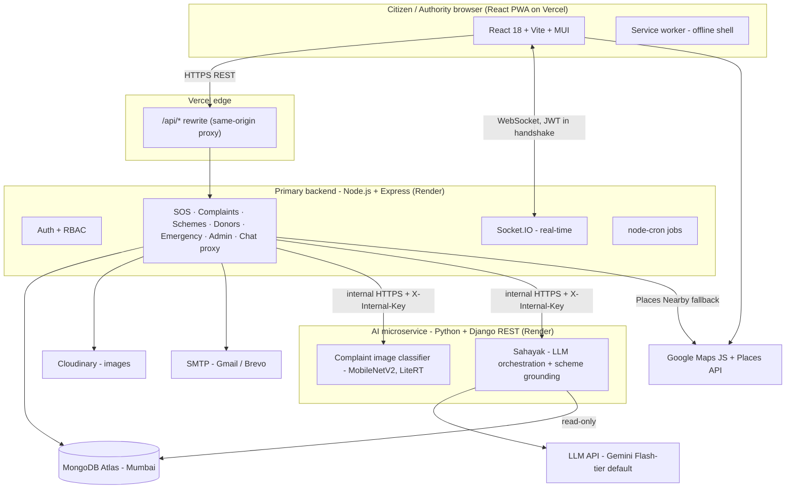
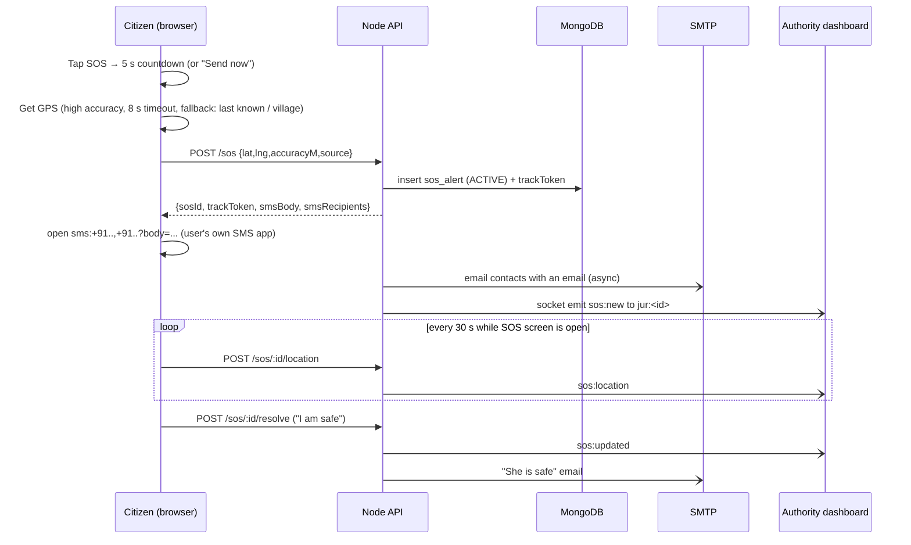
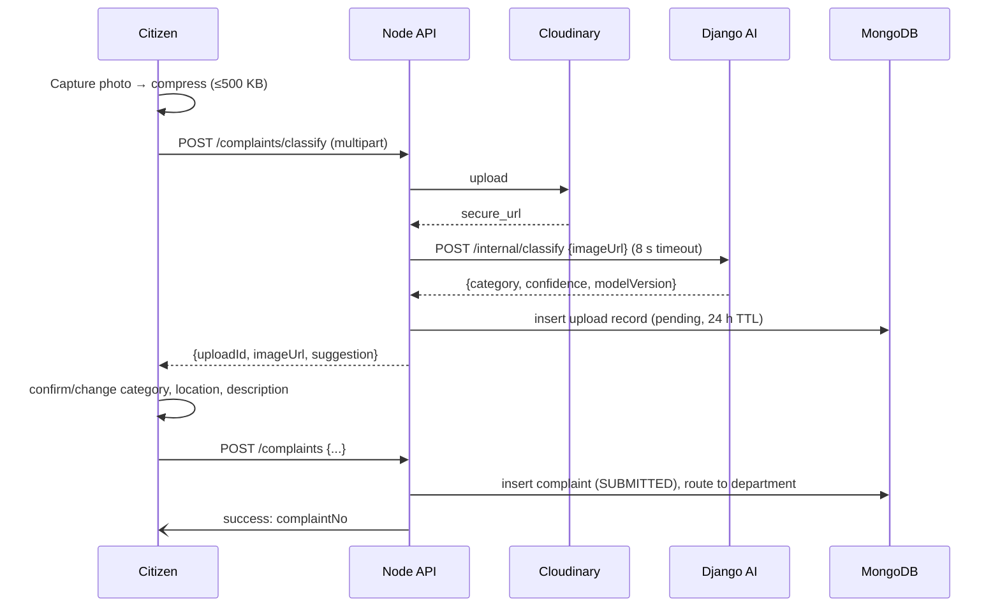

# Suraksha Setu — Technical Requirements Document

| | |
|---|---|
| **Document** | 02 — Technical Requirements Document (TRD) |
| **Version** | 1.0 (draft for team review) |
| **Date** | 26 September 2026 |
| **Based on** | 01 PRD v1.0 |
| **Related docs** | 03 App Flow · 04 UI/UX Brief · 05 Backend Schema · 06 Implementation Plan |

This document says **what we build with and why**. Every choice has a reason so the team can defend it in reviews and a coding agent can follow it without guessing.

---

## 1. Technical principles

1. **Works on a cheap phone on a weak network.** Small bundles, compressed images, lazy loading, offline shell.
2. **One source of truth per concern.** One auth system (our JWT), one database (MongoDB), one set of shared constants (categories, statuses) used by all three services.
3. **AI is separate and optional.** The Django AI service can be down and the app still works: complaints fall back to manual category selection, and Sahayak shows a fallback message.
4. **An SOS never fails silently.** Every step (GPS, server, email) has a fallback, and the on-phone SMS path works even when our server is down.
5. **Privacy by default.** Collect the minimum, mask what others can see, and delete what we no longer need.
6. **Free/low-cost tiers are enough for the pilot**, with a clear upgrade path.

---

## 2. System architecture

### 2.1 High-level view



### 2.2 Layers

| Layer | Responsibility | Deployed on |
|---|---|---|
| **Presentation** | React PWA: citizen app + authority/admin portal (same codebase, role-based routes, admin code lazy-loaded) | Vercel |
| **Application** | Node.js/Express REST API: all business logic, auth, validation, real-time, jobs. The **only** service the browser talks to (except Google Maps tiles). | Render (web service) |
| **Intelligence** | Django REST AI service: image classification, Sahayak chat orchestration. Never called by the browser directly. | Render (web service) |
| **Data** | MongoDB Atlas (primary data), Cloudinary (images) | Atlas M0 → M10 if needed; Cloudinary free |

### 2.3 Why a separate AI service (viva answer)
- TensorFlow/LiteRT and the Python LLM tooling live in Python. Node can't run them well.
- The AI service has different resource needs (memory for the model) and a different release cycle (we retrain models without redeploying the main API).
- **Failure isolation:** if the AI service crashes or is slow, SOS, complaints (manual category), schemes and everything else keep working.
- Cost of this choice: an extra network hop (~50–150 ms) and one more deployment. We accept it.

### 2.4 Repository structure (monorepo)

```
suraksha-setu/
├── apps/
│   ├── web/            # React + Vite PWA
│   ├── api/            # Node.js + Express
│   └── ai/             # Django + DRF
├── shared/
│   └── constants.json  # categories, statuses, blood groups, roles — read by all 3 apps
├── docs/               # these 6 documents + ADRs
├── .github/workflows/  # CI
└── README.md
```

`shared/constants.json` is the single source for enums. Node imports it, Vite imports it, and Django loads it at startup. **No enum values are hard-coded anywhere else.**

---

## 3. Frontend stack

| Concern | Choice | Reason |
|---|---|---|
| Framework | **React 18** | Team knows it. Large ecosystem. Already scaffolded. |
| Build tool | **Vite 5+** | Fast dev server, small production bundles, simple PWA plugin. |
| UI library | **MUI v5** with a custom theme (doc 04) | Accessible components out of the box (focus states, ARIA). Theme tokens let us reach the government-portal look. Already in the stack. |
| Routing | **React Router v6** (data routers, lazy routes) | Code splitting per route, so citizens never download admin code. |
| Server state | **TanStack Query v5** | Caching, retries, background refresh and offline-friendly behaviour with little code. |
| Client state | **Zustand** (auth session, language, font size) | Tiny (~1 KB), no boilerplate. |
| Forms | **React Hook Form + Zod** | Fast forms, one schema for validation and error messages. |
| i18n | **react-i18next** + `i18next-browser-languagedetector` | Standard. Namespaces per module. Hindi default. Pluralisation and interpolation. |
| HTTP | **Axios** with interceptors | Attaches the access token, refreshes on 401, retries idempotent GETs. |
| Maps | **@vis.gl/react-google-maps** (or `@react-google-maps/api`, already used) | Official-style React wrapper for the Google Maps JS API. |
| Real-time | **socket.io-client** | Matches the server. Auto-reconnect. |
| Charts | **MUI X Charts** | Consistent look with MUI. Only loaded in the admin bundle. |
| Images | **browser-image-compression** | Compress photos to ≤ 1280 px and ≤ 500 KB before upload. Saves data and time. |
| PWA | **vite-plugin-pwa** (Workbox) | Precache app shell, runtime cache for scheme pages and the helplines JSON. |
| Icons | **Material Symbols Rounded** (subset) | Consistent, recognisable pictograms. |
| Fonts | **Noto Sans + Noto Sans Devanagari** (self-hosted, `font-display: swap`) | Correct Hindi rendering. Self-hosting avoids an extra DNS lookup on slow networks. |
| Letter print | Print-specific CSS + `window.print()` | The browser renders Hindi correctly when saving to PDF. Avoids Devanagari font problems in JS PDF libraries. |
| Testing | **Vitest + React Testing Library**, **Playwright** (E2E) | Fast unit tests, real-browser flows. |

### 3.1 Frontend performance budget
- Citizen initial JS: **≤ 250 KB gzipped**. Admin, maps and charts are lazy-loaded.
- LCP < 3 s on Lighthouse "Slow 4G" mobile.
- No image over 200 KB on citizen pages except user uploads.
- Fonts: only the weights 400, 500 and 700.

### 3.2 Browser support
Chrome for Android 90+, Samsung Internet 15+, desktop Chrome/Edge/Firefox (last 2 versions), Safari 15+. Target screen: **360 × 640** upwards.

---

## 4. Backend stack

### 4.1 Primary API (Node.js)

| Concern | Choice | Reason |
|---|---|---|
| Runtime | **Node.js 22 LTS** | Current LTS. Long support window. |
| Framework | **Express 4.x** (already scaffolded) | Simple and well known. Upgrading to 5.x is optional and low-risk later. |
| ODM | **Mongoose 8** | Schemas, validation and middleware on top of MongoDB. Already in use. |
| Validation | **Zod** (request body/query/params) | Same library as the frontend, and clear error messages. |
| Auth | **jsonwebtoken**, **bcrypt** (cost 12) | Already built. See section 6. |
| Uploads | **Multer** (memory storage, 5 MB limit) → **Cloudinary SDK** | No local disk needed on Render. Cloudinary handles resizing and the CDN. |
| Real-time | **Socket.IO 4** | Rooms, auto-reconnect, fallback to long-polling on bad networks. |
| Email | **Nodemailer** via Gmail SMTP (app password), Brevo SMTP as backup | Free for pilot volumes. |
| Security middleware | **helmet**, **cors** (allow-list), **express-rate-limit**, **express-mongo-sanitize** | Standard hardening. |
| Logging | **pino** + pino-http (JSON logs, PII redaction) | Fast, structured, readable in Render logs. |
| Jobs | **node-cron** | Auto-close stale SOS, expire tracking tokens, weekly scheme-verification reminder. |
| HTTP client (to AI) | **axios** with 8 s timeout, 1 retry | Fail fast and fall back. |
| Testing | **Vitest** or Jest + **Supertest** + **mongodb-memory-server** | Real HTTP tests against an in-memory DB. |

### 4.2 AI microservice (Python)

| Concern | Choice | Reason |
|---|---|---|
| Runtime | **Python 3.11** | Stable with TensorFlow and LiteRT wheels. |
| Framework | **Django 5 + Django REST Framework** | Already chosen and scaffolded. Good structure, serializers and auth hooks. Server: **gunicorn**, 2 workers. |
| Model training | **TensorFlow 2.x / Keras** on Google Colab (T4 GPU) | MobileNetV2 transfer learning, as planned. |
| Model serving | **LiteRT (formerly TensorFlow Lite)** interpreter (`ai-edge-litert`; `tflite-runtime` as fallback) with a float16-quantised `.tflite` model | Full TensorFlow needs more RAM than Render's small instances (512 MB). The LiteRT runtime is much smaller and faster on CPU, and a quantised MobileNetV2 is ~5–7 MB. |
| Image handling | **Pillow** | Decode, resize to 224×224, normalise. |
| LLM client | Provider adapter; default **Google Gemini** Flash-tier model via the `google-genai` SDK | Good Hindi quality, low cost, generous free tier for development. The adapter lets us swap in another provider (for example, Anthropic or OpenAI) by changing an env var. |
| Grounding | Load the published scheme catalogue from MongoDB (**read-only user**) and pass the relevant scheme records into the prompt | The catalogue is small (≤ 50 schemes), so it fits in context. **No vector database in v1.** Simpler and cheaper, and the answers stay traceable. |
| DB driver | **pymongo** (read-only credentials) | Only needs to read schemes. |
| Testing | **pytest** + DRF test client | |

### 4.3 CNN specification (summary)
- **Classes (7):** `road_damage`, `garbage`, `streetlight`, `waterlogging`, `water_supply`, `encroachment`, `other`.
- **Architecture:** MobileNetV2 (ImageNet weights) → GlobalAveragePooling → Dense(256, ReLU) → Dropout(0.4) → Dense(128, ReLU) → Dropout(0.3) → Dense(7, softmax).
- **Training:** Phase 1: base frozen, 20 epochs. Phase 2: unfreeze the top 30 layers, lr = 1e-5. Augmentation: flip, rotation ±20°, zoom, brightness ±30%.
- **Data:** RDD2022 (road damage, India subset), Open Images V7 (garbage), and a custom labelled set (streetlight, waterlogging, handpumps/water supply, encroachment). **New for the rural focus:** collect handpump and village-road photos during field visits (with consent) for the `water_supply` and `road_damage` classes.
- **Targets:** ≥ 87% top-1 accuracy on the held-out test set, < 300 ms inference on CPU.
- **Decision rule:** confidence ≥ 0.60 → pre-select the category; below that → the user chooses manually.
- **Versioning:** each model file is named `civic_cnn_v<N>.tflite` with a `model_card.json` (classes, accuracy, date, dataset version). The AI service reports the model version in every response and it's stored on the complaint.

### 4.4 Sahayak specification (summary)
- **Endpoint flow:** browser → Node `/api/v1/chat/...` (auth, rate limit, stores messages) → Django `/internal/sahayak/reply` → LLM → Django → Node → browser.
- **System prompt rules:**
  1. Reply in the user's language, simple words, short sentences.
  2. Use only the scheme records provided. If unsure, say so and link to the official site.
  3. Never claim to be a government service.
  4. If there are any signs of an emergency, return `intent: "emergency"` first.
  5. For letters, collect the required fields, then output structured JSON: `{to, subject, body, place, date, applicantName}`.
- **Modes:** `general`, `scheme_help` (scheme ID in context), `letter` (letter template ID in context).
- **Emergency detection:** a keyword pre-check in Node (Hindi + English + Hinglish list: "bachao", "बचाओ", "help", "madad", "accident", "maar", …) runs **before** the LLM call. If it matches, Node returns the emergency card immediately without waiting for the LLM.
- **Limits:** 30 user messages per day, max 1,000 characters per message, last 10 messages sent as context.

---

## 5. Database

| Item | Choice | Reason |
|---|---|---|
| Engine | **MongoDB Atlas**, region **Mumbai (ap-south-1)** | Already in use. Data stays in India (low latency and good practice under the DPDP Act). |
| Tier | M0 (free) for development, **M10 or Flex** for the pilot if we exceed 512 MB or need backups | M0 has no automated backups. The pilot needs them (see section 9.6). |
| Geospatial | `2dsphere` indexes on GeoJSON Points | Donor search, nearby services, and authority jurisdiction views. |
| Validation | Mongoose schemas + Zod at the API boundary | Two layers: bad input is rejected early, and bad data can't be saved. |
| Bilingual content | `{ en: String, hi: String }` objects for all catalogue text | One document per scheme holds both languages. |

The full schema is in doc 05.

---

## 6. Authentication and authorisation

### 6.1 Identity
- **Login ID:** Indian mobile number (10 digits, stored in E.164 `+91XXXXXXXXXX`). Email is optional.
- **Password:** minimum 8 characters, must not be only digits, bcrypt cost 12.
- **No SMS OTP in v1** (DLT and cost; see PRD section 9). Phone numbers aren't verified in v1. This is a known limitation and gets a "verified" flag field for later.
- **Firebase Auth (listed in the earlier deck) is dropped.** We already have JWT auth working, and two auth systems would double the complexity.

### 6.2 Tokens and sessions

| Token | Lifetime | Stored where | Notes |
|---|---|---|---|
| **Access token** (JWT, HS256) | 15 minutes | In memory (Zustand), **not** localStorage | Payload: `sub` (userId), `role`, `jur` (jurisdictionId), `dept` (departmentId, authority only), `ver` (tokenVersion). |
| **Refresh token** (random 256-bit, opaque) | 30 days (citizen), 12 hours (authority/admin) | `httpOnly; Secure; SameSite=Lax; Path=/api/v1/auth` cookie | Stored **hashed** (SHA-256) in `sessions`. **Rotated on every use.** Reusing an old token revokes the whole session family. |

- **Same-origin cookies:** the frontend calls `/api/*` on its own Vercel domain, and a Vercel rewrite forwards that to Render. The refresh cookie is therefore first-party, which avoids third-party-cookie blocking in Safari and privacy browsers.
- **Socket.IO** connects directly to the Render URL and sends the access token in `auth: { token }` during the handshake. The server verifies it and joins rooms based on role.
- **Logout:** deletes the session record and clears the cookie. "Log out of all devices" increments `tokenVersion` on the user, so all existing access tokens fail.
- **Password reset:** (a) with email: a 30-minute single-use link; (b) without email: an admin generates a 6-digit one-time code (valid 30 minutes) after verifying the person in the field. Both paths revoke all sessions on success.
- **Staying logged in matters for SOS.** Citizens get 30-day refresh tokens so they don't have to log in during an emergency. Short authority sessions protect the more powerful accounts.

### 6.3 Roles (RBAC)

| Role | Created by | Scope |
|---|---|---|
| `citizen` | Self-registration | Own data only, plus public catalogue data |
| `authority` | Admin | Complaints and SOS **within their `jurisdictionIds`**, filtered to their `departmentId` for complaints (the Panchayat secretary can have `departmentId = null`, which means all departments) |
| `admin` | Seeded / another admin | Everything |

The full permission matrix is in doc 05, section 8. It's enforced in middleware: `requireAuth` → `requireRole(...)` → a resource-level ownership/jurisdiction check in the service layer.

---

## 7. APIs

### 7.1 Conventions
- Base path: `/api/v1`. JSON only (except multipart uploads).
- **Success envelope:** `{ "data": ..., "meta": { "page": 1, "limit": 20, "total": 134 } }` (meta only on lists).
- **Error envelope:** `{ "error": { "code": "VALIDATION_ERROR", "message": "Human readable (in the request language)", "details": [{ "field": "phone", "issue": "invalid" }] } }`
- **Error codes:** `VALIDATION_ERROR` 400, `UNAUTHENTICATED` 401, `TOKEN_EXPIRED` 401, `FORBIDDEN` 403, `NOT_FOUND` 404, `CONFLICT` 409, `ACCOUNT_LOCKED` 423, `RATE_LIMITED` 429, `AI_UNAVAILABLE` 503 (non-fatal), `INTERNAL` 500.
- **Language:** the client sends `Accept-Language: hi` or `en`, and error messages come back in that language.
- **Pagination:** `?page=1&limit=20` (max 100). Sort: `?sort=-createdAt`.
- **IDs:** MongoDB ObjectId strings. Complaints also have a public `complaintNo`.
- **Timestamps:** ISO 8601 UTC. The frontend displays them in IST.

### 7.2 Endpoints — primary API

**Auth**

| Method | Path | Access | Purpose |
|---|---|---|---|
| POST | `/auth/register` | Public | Create a citizen account (name, phone, password, village/jurisdictionId, language, consent) |
| POST | `/auth/login` | Public | Phone + password → access token + refresh cookie |
| POST | `/auth/refresh` | Cookie | Rotate the refresh token, return a new access token |
| POST | `/auth/logout` | Auth | Revoke the current session |
| POST | `/auth/logout-all` | Auth | Revoke all sessions |
| POST | `/auth/password/forgot` | Public | Send the email reset link (if the account has an email) |
| POST | `/auth/password/reset` | Public | Reset with an email token **or** an admin-issued code |
| GET | `/auth/me` | Auth | Current user profile |

**Profile and contacts**

| Method | Path | Access | Purpose |
|---|---|---|---|
| PATCH | `/users/me` | Auth | Update name, language, font size, village, email |
| PUT | `/users/me/password` | Auth | Change password (old + new) |
| GET | `/users/me/contacts` | Citizen | List emergency contacts |
| POST | `/users/me/contacts` | Citizen | Add a contact (max 5) |
| PATCH | `/users/me/contacts/:contactId` | Citizen | Edit a contact |
| DELETE | `/users/me/contacts/:contactId` | Citizen | Remove a contact |
| DELETE | `/users/me` | Auth | Delete the account (soft-delete + anonymise; see doc 05) |

**SOS (M1)**

| Method | Path | Access | Purpose |
|---|---|---|---|
| POST | `/sos` | Citizen | Trigger: `{ lat, lng, accuracyM, source: "gps"\|"last_known"\|"village" }` → SOS + `trackToken` + `smsBody` + `smsRecipients` |
| POST | `/sos/:id/location` | Owner | Push a location update `{ lat, lng, accuracyM }` |
| POST | `/sos/:id/resolve` | Owner | "I am safe" → RESOLVED_SAFE (or FALSE_ALARM if < 60 s) |
| GET | `/sos/mine` | Citizen | Own SOS history |
| GET | `/sos/active` | Authority | Active SOS in the officer's jurisdictions |
| GET | `/sos/:id` | Owner / Authority | Detail with the location trail |
| POST | `/sos/:id/acknowledge` | Authority | Mark acknowledged (records who and when) |
| POST | `/sos/:id/close` | Authority | Close with a note → RESOLVED_BY_AUTHORITY |
| GET | `/track/:token` | **Public** | Minimal live view for contacts: first name, last location, updatedAt, status |

**Complaints (M2)**

| Method | Path | Access | Purpose |
|---|---|---|---|
| POST | `/complaints/classify` | Citizen | Multipart image → uploads to Cloudinary, calls AI → `{ uploadId, imageUrl, suggestion: { category, confidence, modelVersion } \| null }` |
| POST | `/complaints` | Citizen | Create: `{ uploadId, category, aiSuggestion, description, location, landmark, onBehalfOf? }` |
| GET | `/complaints/mine` | Citizen | Own complaints (paginated, filter by status) |
| GET | `/complaints/:id` | Owner / Authority (in scope) | Detail + public timeline (internal notes only for authority) |
| POST | `/complaints/:id/reopen` | Owner | Within 7 days of RESOLVED, with a reason |
| GET | `/complaints` | Authority | List in scope. Filters: `status, category, departmentId, from, to, q` |
| PATCH | `/complaints/:id/status` | Authority | `{ status, publicNote?, internalNote?, rejectionReason? }`. Transitions are validated (doc 05, section 5.6) |
| PATCH | `/complaints/:id/assign` | Authority | `{ departmentId, assigneeId? }` |
| PATCH | `/complaints/:id/category` | Authority | Re-categorise (stored as a correction for model retraining) |
| POST | `/complaints/:id/resolution-photo` | Authority | Multipart image |
| GET | `/complaints/export.csv` | Authority | CSV for a date range, within scope |

**Schemes (M3)**

| Method | Path | Access | Purpose |
|---|---|---|---|
| GET | `/schemes` | Public | List published schemes. Filters: `category, q, level (central/state)` |
| GET | `/schemes/:slug` | Public | Scheme detail |
| POST | `/schemes/eligibility` | Public (logged if authenticated) | Body = questionnaire answers → `[{ schemeId, result: "likely"\|"maybe"\|"no", reasons: [...] }]` |
| GET | `/users/me/saved-schemes` | Citizen | Saved schemes with checklist state |
| PUT | `/users/me/saved-schemes/:schemeId` | Citizen | Save / update the document checklist |
| DELETE | `/users/me/saved-schemes/:schemeId` | Citizen | Unsave |

**Blood donors (M4)**

| Method | Path | Access | Purpose |
|---|---|---|---|
| GET | `/donors/me` | Citizen | Own donor profile (404 if not a donor) |
| PUT | `/donors/me` | Citizen | Create/update the donor profile |
| PATCH | `/donors/me/availability` | Citizen | `{ available: bool }` |
| DELETE | `/donors/me` | Citizen | Remove the donor profile |
| GET | `/donors/search` | Citizen | `?bloodGroup=O+&lat=&lng=&radiusKm=25&includeCompatible=true` → masked results |
| POST | `/donors/:donorId/reveal` | Citizen | Reveals the phone number, logs the request (10 per day) |

**Emergency services (M5)**

| Method | Path | Access | Purpose |
|---|---|---|---|
| GET | `/emergency/helplines` | Public | National helpline list (also bundled offline) |
| GET | `/emergency/nearby` | Public | `?lat=&lng=&type=hospital&radiusKm=25` → curated directory, then Places fallback if fewer than 3 results |

**Sahayak (M7)**

| Method | Path | Access | Purpose |
|---|---|---|---|
| POST | `/chat/sessions` | Citizen | Start a session `{ mode, schemeId?, letterType? }` |
| GET | `/chat/sessions` | Citizen | List own sessions (last 20) |
| GET | `/chat/sessions/:id` | Owner | Messages in the session |
| POST | `/chat/sessions/:id/messages` | Owner | Send a message → assistant reply `{ text, intent, cards?, letter? }` |
| DELETE | `/chat/sessions/:id` | Owner | Delete the session |

**Notifications**

| Method | Path | Access | Purpose |
|---|---|---|---|
| GET | `/notifications` | Auth | Own notifications (paginated) |
| POST | `/notifications/read` | Auth | `{ ids: [...] }` or `{ all: true }` |

**Authority / Admin (M6)**

| Method | Path | Access | Purpose |
|---|---|---|---|
| GET | `/admin/overview` | Authority | KPI cards + recent activity (scoped) |
| GET | `/admin/analytics` | Authority | `?from=&to=` → series for charts (scoped) |
| GET/POST/PATCH | `/admin/users`, `/admin/users/:id` | Admin | List users; create authority accounts; deactivate |
| POST | `/admin/users/:id/reset-code` | Admin | Issue a one-time password reset code |
| GET/POST/PATCH/DELETE | `/admin/schemes`, `/admin/schemes/:id` | Admin | Scheme CRUD, publish/unpublish, mark verified |
| GET/POST/PATCH/DELETE | `/admin/emergency-services`, `/:id` | Admin | Directory CRUD |
| GET/POST/PATCH | `/admin/departments`, `/:id` | Admin | Department CRUD |
| GET/POST/PATCH | `/admin/jurisdictions`, `/:id` | Admin | Jurisdiction CRUD |
| GET | `/admin/audit-logs` | Admin | Filter by actor, action, date |

**Supporting endpoints**

| Method | Path | Access | Purpose |
|---|---|---|---|
| GET | `/jurisdictions?type=village&q=` | Public | Village picker on registration (S-04) and donor/profile forms |
| GET | `/complaints/route-preview?category=&lat=&lng=` | Citizen | Department name shown on the complaint review step (S-10 step 4) |
| GET | `/complaints/classify/warmup` | Citizen | Wakes the AI service when the complaint wizard opens |
| POST | `/complaints/:id/reveal-phone` | Authority (in scope) | Shows the complainant's phone (audited) |
| POST | `/sos/:id/reveal-phone` | Authority (in scope) | `{ target: "user" \| contactId }` → phone number (audited) |
| POST | `/events` | Public (rate-limited) | Client-side usage events (`app_install`, `emergency_call_tap`) → `usage_events` |
| POST | `/client-errors` | Public (rate-limited) | Frontend error reports (no PII) → logs only |
| GET | `/health` | Public | `{ status, db, ai }` for uptime monitoring |

### 7.3 Endpoints — AI service (internal only)
Every request must carry `X-Internal-Key: <AI_INTERNAL_KEY>`. The service rejects requests without it (401). CORS is disabled (no browser access).

| Method | Path | Body | Response |
|---|---|---|---|
| POST | `/internal/classify` | `{ imageUrl }` (Cloudinary URL, downloaded server-side, max 5 MB) | `{ category, confidence, top3: [...], modelVersion, inferenceMs }` |
| POST | `/internal/sahayak/reply` | `{ language, mode, history: [...], message, schemeIds?, letterType?, userContext: { village, district } }` | `{ text, intent: "answer"\|"emergency"\|"letter_ready"\|"need_info"\|"out_of_scope", cards: [{type:"scheme", slug}], letter?: {...} }` |
| GET | `/internal/health` | — | `{ status, modelVersion, llmProvider }` |

### 7.4 Real-time events (Socket.IO)

| Room | Joined by | Events (server → client) |
|---|---|---|
| `jur:<jurisdictionId>` | Authority/admin users for each of their jurisdictions | `sos:new`, `sos:location`, `sos:updated`, `complaint:new` |
| `admin` | Admins | All of the above for every jurisdiction |
| `user:<userId>` | Each logged-in user | `notification:new`, `sos:acknowledged`, `complaint:updated` |

Client → server: none in v1 (all writes go through REST, so there's one validation path).

### 7.5 External APIs

| Service | Used for | Cost control |
|---|---|---|
| Google Maps JavaScript API | Maps on SOS, complaint pin, nearby services, authority live map | Restrict the key to our domains. Set daily quotas and a budget alert in Cloud Console. |
| Google Places API (Nearby Search) | Fallback for M5 when the curated directory has fewer than 3 results | Server-side key only. Store only `place_id` (per Google's terms). |
| Cloudinary | Complaint and resolution photos | Upload preset with `c_limit,w_1280,q_auto`, folder per environment |
| Gmail / Brevo SMTP | SOS emails, password-reset emails, complaint status emails (optional) | Pilot volume is well under free limits |
| LLM API (Gemini default) | Sahayak | Per-user daily cap, max output tokens (800), budget alert |

---

## 8. Key flows (sequence)

### 8.1 SOS



**If the API is unreachable:** the client still opens the SMS app with a Google Maps link built from GPS (`https://maps.google.com/?q=lat,lng`) and shows a "Call 112" button. It retries the POST in the background every 10 s for 2 minutes.

### 8.2 Complaint with AI



**If the AI times out or errors:** `suggestion: null` → the UI shows manual category tiles. It's logged, but never shown as an error to the user.

### 8.3 Routing rule
`department = routingTable[jurisdiction.type][category]`, stored in the `departments` collection as `handlesCategories[]` per jurisdiction. Default rural mapping for the pilot:

| Category | Default department (rural MP) |
|---|---|
| road_damage | Gram Panchayat (village roads) / PWD (district roads) |
| garbage | Gram Panchayat (Swachh Bharat Mission-Gramin) |
| streetlight | Gram Panchayat |
| waterlogging | Gram Panchayat |
| water_supply | PHED (Public Health Engineering Department) — handpumps |
| encroachment | Gram Panchayat / Revenue (Patwari) |
| other | Gram Panchayat (triage) |

The authority can always reassign. This mapping is **seed data**, editable by an admin, and must be **confirmed with the Panchayat during the field visit**.

---

## 9. Deployment plan

### 9.1 Environments

| Env | Frontend | API | AI | DB | Purpose |
|---|---|---|---|---|---|
| **local** | `vite` :5173 | `node` :5000 | `gunicorn`/`runserver` :8000 | Atlas dev cluster or local Mongo (Docker) | Development |
| **preview** | Vercel preview per PR | Render preview (optional) | — | Atlas dev DB | Review PRs |
| **production** | Vercel (`main`) | Render web service | Render web service | Atlas prod DB (separate project) | Pilot and demo |

### 9.2 Hosting details
- **Vercel:** framework preset Vite, `vercel.json` rewrites: `{ "source": "/api/:path*", "destination": "https://<api>.onrender.com/api/:path*" }`, SPA fallback to `index.html`, security headers.
- **Render (API):** Node 22, `npm ci && npm run build`, start `node dist/server.js`, health check `/api/v1/health`, region **Singapore** (closest Render region to India).
- **Render (AI):** Python 3.11, `pip install -r requirements.txt`, start `gunicorn config.wsgi -w 2 -b 0.0.0.0:$PORT --timeout 30`. The model file is downloaded at build time from a GitHub Release asset (keeps the repo small).
- **Cold starts:** free Render instances sleep after 15 minutes. **For the pilot and demo weeks, upgrade the API to the smallest paid instance.** During development, use an UptimeRobot ping every 5 minutes on `/health`.

### 9.3 Environment variables

| Service | Variable | Notes |
|---|---|---|
| web | `VITE_API_BASE=/api/v1`, `VITE_SOCKET_URL`, `VITE_GOOGLE_MAPS_KEY` (browser key, domain-restricted), `VITE_APP_ENV` | |
| api | `MONGODB_URI`, `JWT_ACCESS_SECRET`, `REFRESH_TOKEN_PEPPER`, `CORS_ORIGINS`, `CLOUDINARY_URL`, `SMTP_HOST/PORT/USER/PASS`, `MAIL_FROM`, `AI_BASE_URL`, `AI_INTERNAL_KEY`, `GOOGLE_PLACES_KEY` (server key), `PUBLIC_APP_URL`, `NODE_ENV` | |
| ai | `AI_INTERNAL_KEY`, `MONGODB_URI_READONLY`, `LLM_PROVIDER`, `LLM_API_KEY`, `LLM_MODEL`, `MODEL_PATH`, `DJANGO_SECRET_KEY`, `ALLOWED_HOSTS` | |

Secrets live only in Vercel/Render dashboards and a local `.env` (git-ignored). `.env.example` files are committed.

### 9.4 CI/CD (GitHub Actions)
On every PR: install → lint (ESLint, Ruff) → type-check (if TS) → unit tests (web, api, ai) → build web. On merge to `main`: Vercel and Render auto-deploy. Branch protection: at least 1 review, CI green.

### 9.5 Monitoring
- Render logs (pino JSON), plus `/health` monitored by UptimeRobot (email alert).
- Frontend errors: `window.onerror` + `unhandledrejection` → `POST /api/v1/client-errors` (rate-limited, no PII) in v1. A proper tool like Sentry is optional.
- Weekly check of Google Cloud, Cloudinary and LLM usage dashboards during the pilot.

### 9.6 Backups
Pilot DB on an Atlas tier with automated snapshots (M10/Flex), **or** a nightly `mongodump` GitHub Action to an encrypted private artifact if we stay on M0. Restore tested once before the pilot.

---

## 10. Security requirements

| ID | Requirement |
|---|---|
| SEC-01 | HTTPS everywhere (Vercel/Render defaults). HSTS header. |
| SEC-02 | Passwords hashed with bcrypt (cost 12). Never logged or returned. |
| SEC-03 | Access tokens in memory only. Refresh tokens hashed in the DB, rotated, reuse-detection. |
| SEC-04 | RBAC + jurisdiction scoping enforced on the **server** for every request (never trust the UI). |
| SEC-05 | Input validation with Zod on every endpoint. `express-mongo-sanitize` strips `$` and `.` from keys (prevents NoSQL injection). |
| SEC-06 | Rate limits: login 5 per 15 min per phone+IP; register 5 per hour per IP; password reset 3 per hour; general API 120 per min per user; complaint create 10 per day; donor reveal 10 per day; chat 30 messages per day. **SOS is never rate-limited** (only flagged after 3 per hour). |
| SEC-07 | Uploads: only `image/jpeg`, `image/png`, `image/webp`, checked by magic bytes as well as MIME type. Max 5 MB. EXIF stripped by Cloudinary (`strip` flag) to remove hidden GPS/device data. |
| SEC-08 | CORS allow-list: production and preview frontend origins only. |
| SEC-09 | `helmet` defaults + a Content Security Policy allowing only self, Google Maps domains, Cloudinary and fonts. |
| SEC-10 | Node → AI calls use a shared secret header (`X-Internal-Key`, 32+ random bytes) over HTTPS. The AI service has no public CORS and uses a read-only DB user. |
| SEC-11 | Secrets only in platform env settings. Separate keys for dev and prod. The browser Maps key is restricted by HTTP referrer, and the Places key is server-only and API-restricted. |
| SEC-12 | **Privacy:** donor phones masked; SOS location visible only to the owner, their tracking-link holders (until expiry) and in-scope authorities; public tracking page shows the first name only. |
| SEC-13 | **DPDP Act 2023 alignment:** clear consent at signup (purpose: safety alerts, complaints, scheme matching), purpose limitation, the right to delete the account, data minimisation, and retention limits (doc 05, section 10). |
| SEC-14 | Logs redact phone, email, tokens and precise coordinates (rounded to 3 decimal places ≈ 100 m in logs). |
| SEC-15 | Audit log for every authority/admin write action. |
| SEC-16 | Sahayak: user text is always sent as a user message, never concatenated into the system prompt. The LLM has no tools and no DB write access. Output is rendered as plain text/markdown (no raw HTML). Letters carry the footer "Drafted with Sahayak — please check before submitting". |
| SEC-17 | Dependency scanning: `npm audit` / `pip-audit` in CI, Dependabot enabled. |
| SEC-18 | Account lockout: after 10 failed logins, 30-minute lock and a notice to the user (with an email if one exists). |

---

## 11. Non-functional requirements

| Area | Requirement |
|---|---|
| Performance | API p95 < 400 ms for non-AI endpoints. SOS create p95 < 1 s. Pages: see 3.1. |
| Availability | 99% during pilot weeks. AI service degradation must not affect core flows. |
| Scalability | Pilot: < 500 users. Design supports ~50k users on Atlas M10 + 2 API instances without code changes (stateless API, Socket.IO Redis adapter needed only when running more than 1 instance). |
| Accessibility | WCAG 2.1 AA: contrast, focus visible, labels, 48 px touch targets, screen-reader names in both languages. |
| Localisation | 100% of UI strings in `hi` and `en` JSON files. CI fails if a key is missing in either language. |
| Offline | App shell, helplines, last 10 viewed schemes and the fake call work offline. SOS offline = SMS app + tel:112 only. |
| Maintainability | ESLint + Prettier, Ruff + Black. Folder-by-feature. Each module has a README. |
| Testability | ≥ 60% line coverage on API services. E2E for SOS, complaint and schemes happy paths. |

---

## 12. Technical decisions log (ADR summary)

| # | Decision | Alternatives considered | Reason |
|---|---|---|---|
| ADR-01 | Web app (PWA) first, native app later | React Native now | One codebase, faster to ship, no app-store step, works on any phone with Chrome. PWA gives install + offline. |
| ADR-02 | Separate Django AI microservice | Everything in Node; Python serverless functions | Python ML ecosystem, failure isolation, independent model updates (section 2.3). |
| ADR-03 | MongoDB Atlas | PostgreSQL + PostGIS | Already built and working. Native geospatial. Flexible bilingual documents. Mumbai region. PostGIS would be equally valid but means rework. |
| ADR-04 | Phone + password auth with our own JWT; drop Firebase Auth | Firebase phone OTP; SMS OTP via MSG91 | Already working. No per-SMS cost or DLT approval. One auth system. |
| ADR-05 | SOS alerts via the user's own SMS app (`sms:` link) + email + dashboard | Twilio/MSG91 server SMS | Server SMS in India needs DLT registration and costs money, and Twilio's India delivery needs registered templates. The user's SMS app is free and works without our server. Trade-off: the user must press "Send" in the SMS app, which we make obvious. Server SMS is the v2 plan. |
| ADR-06 | Access token in memory + rotating httpOnly refresh cookie via same-origin rewrite | JWT in localStorage | Protects tokens from XSS theft. The same-origin rewrite avoids third-party-cookie blocking. |
| ADR-07 | LiteRT (TFLite) for CNN inference | Full TensorFlow SavedModel; TF.js in browser | Fits in 512 MB RAM, faster CPU inference. In-browser would add ~5–7 MB to the page on slow networks. |
| ADR-08 | LLM API + catalogue grounding for Sahayak; no vector DB | Fine-tuned model; RAG with a vector DB; rule-based bot | Small catalogue fits in context. Hosted LLMs handle Hindi well. Grounding keeps answers traceable. A vector DB is overkill at this size. |
| ADR-09 | Curated emergency directory + Google Places fallback | Places only; OpenStreetMap only | Places data is thin in villages and may be outdated. A curated list for Sehore district is reliable, and Places fills gaps. |
| ADR-10 | Socket.IO for real-time | Polling every 30 s; Firebase Realtime DB | SOS needs sub-5 s alerts. Socket.IO falls back to long-polling on bad networks and runs on Render. |
| ADR-11 | MUI with a custom government-style theme | Tailwind + custom components | Already in use. Accessible components save time. The theme gets us the look we need. |
| ADR-12 | react-i18next with Hindi as the default | Separate Hindi site; machine translation at runtime | Standard, key-based, reviewable translations. Runtime MT is unreliable for safety text. |
| ADR-13 | Print CSS for letters (browser "Save as PDF") | jsPDF / pdfmake | Correct Devanagari shaping with zero extra JS. |
| ADR-14 | Monorepo with shared `constants.json` | Three repos | One place for enums. One PR can change all three services consistently. |
| ADR-15 | Remove the cyber-scam module | Keep it as a hidden feature | Supervisor direction. It reduces scope and focuses on rural needs. |

---

## 13. Technical risks

| Risk | Mitigation |
|---|---|
| GPS inaccurate or slow indoors / on cheap phones | 8 s timeout, `enableHighAccuracy`, accept ≤ 100 m, otherwise send the best available and label it "approximate". Fall back to last known or the village centroid. |
| Browser blocks the `sms:` link or the user has no SIM (Wi-Fi only) | Detect failure (no visibility change within 2 s) and show a "Copy message" button and WhatsApp share (`https://wa.me/?text=`). |
| AI service cold start > 8 s | Timeout → manual category. Warm-up ping on the complaint screen load (`GET /complaints/classify/warmup` → AI health). |
| LLM gives wrong scheme facts | Grounding, "check with the office" disclaimer, scheme cards link to our verified pages, and a team review of 50 sample conversations before the pilot. |
| Google Maps bill surprise | Quotas + budget alerts. List-first UI (map only on request). No Places calls when the curated directory has enough results. |
