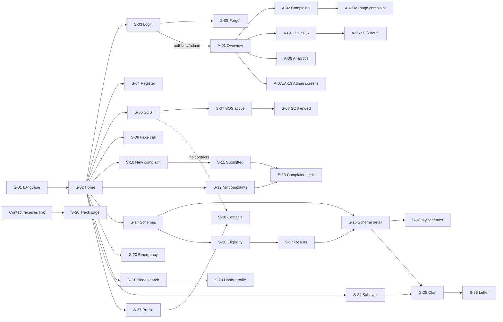

# Suraksha Setu — App Flow Document

| | |
|---|---|
| **Document** | 03 — App Flow (screens, actions, navigation, states) |
| **Version** | 1.0 (draft for team review) |
| **Date** | 26 September 2026 |
| **Based on** | 01 PRD v1.0 · 02 TRD v1.0 |
| **Related docs** | 04 UI/UX Brief (visual rules) · 05 Backend Schema (data) |

This document lists **every screen** and what happens on **every action**. A coding agent should be able to build the app from it without guessing. When this document and another one disagree on behaviour, this one wins; on visuals, doc 04 wins; on data, doc 05 wins.

---

## 0. How to read this document

### 0.1 IDs
- `S-xx` = citizen/public screens · `A-xx` = authority/admin portal screens · `X-xx` = system screens (errors, offline).
- `FR-…` / `US-…` references point to the PRD.

### 0.2 Standard states (apply to every screen unless the screen says otherwise)

| State | Standard behaviour |
|---|---|
| **Loading** | Skeleton placeholders shaped like the final content (not a spinner on a blank page). If loading takes > 10 s, show "Taking longer than usual… / सामान्य से ज़्यादा समय लग रहा है…" with a **Retry** button. |
| **Error (network)** | Inline card: icon + "Couldn't load. Check your internet. / लोड नहीं हो सका। इंटरनेट जाँचें।" + **Retry**. Keep whatever was already on screen. |
| **Error (server 5xx)** | Same card with "Something went wrong on our side. Please try again. / हमारी तरफ़ से गड़बड़ हुई। फिर से कोशिश करें।" |
| **Error (validation)** | Message under the specific field, in red text + error icon. Focus moves to the first invalid field. The form keeps the entered values. |
| **Empty** | Illustration/icon + one sentence saying why it's empty + one primary action that fixes it. |
| **Success (action)** | Toast (snackbar) at the bottom for 4 s, with a check icon. For major actions (SOS, complaint submitted) a full success screen is used instead. |
| **Permission denied (403)** | X-02. |
| **Session expired** | The API client silently refreshes. If refresh fails, go to X-04. |

### 0.3 Text rules
- All visible text comes from i18n keys (`module.screen.element`). Examples below show **English / Hindi**. Hindi is the default language.
- Numbers, dates and times display in Indian format (`26 सित॰ 2026, 10:14 PM`) in IST.

### 0.4 Global rule for destructive actions
Delete/cancel actions that lose data show a confirmation dialog: title, one sentence, **Cancel** (secondary) and the destructive action (red). The exception is SOS cancel during the countdown, which is instant (speed matters more there).

---

## 1. Roles and route map

| Route | Screen | Access | Notes |
|---|---|---|---|
| `/welcome` | S-01 Language select | Public | Shown only on first launch (no `lang` saved on the device) |
| `/` | S-02 Home | Public / Citizen | Content differs for logged-out and logged-in users |
| `/login` | S-03 Login | Public (guest-only) | Logged-in users are redirected to `/` (or `/portal` for authority/admin) |
| `/register` | S-04 Register | Public (guest-only) | |
| `/forgot-password` | S-05 Forgot password | Public | |
| `/reset-password` | S-05b Reset password | Public | `?token=` (email link) or code entry |
| `/sos` | S-06 SOS trigger + countdown | Citizen | Logged-out users see S-06-guest |
| `/sos/:id` | S-07 SOS active | Owner | |
| `/sos/:id/done` | S-08 SOS ended | Owner | |
| `/fake-call` | S-09 Fake call setup → S-09b ringing → S-09c in call | Public | Works offline |
| `/complaints/new` | S-10 New complaint (4 steps) | Citizen | |
| `/complaints/new/success` | S-11 Complaint submitted | Citizen | |
| `/complaints` | S-12 My complaints | Citizen | |
| `/complaints/:id` | S-13 Complaint detail | Owner | |
| `/schemes` | S-14 Schemes list | Public | |
| `/schemes/:slug` | S-15 Scheme detail | Public | |
| `/schemes/check` | S-16 Eligibility checker | Public | |
| `/schemes/check/results` | S-17 Eligibility results | Public | Answers held in memory; direct visit without answers → redirect to S-16 |
| `/my-schemes` | S-18 My saved schemes | Citizen | |
| `/emergency` | S-20 Emergency help | Public | Works offline (helplines part) |
| `/blood` | S-21 Blood donor search | Citizen | Logged-out users see a login prompt (donor data is personal) |
| `/blood/donor` | S-23 My donor profile | Citizen | |
| `/sahayak` | S-24 Sahayak home | Citizen | |
| `/sahayak/:sessionId` | S-25 Chat | Owner | |
| `/sahayak/:sessionId/letter/:messageId` | S-26 Letter preview | Owner | |
| `/profile` | S-27 Profile & settings | Citizen | Authority/admin have a portal profile (A-14) |
| `/profile/contacts` | S-28 Emergency contacts | Citizen | |
| `/notifications` | S-29 Notifications | Auth | |
| `/track/:token` | S-30 Public live location | Public (no app chrome) | |
| `/about` | S-31 About & disclaimer | Public | |
| `/privacy` | S-32 Privacy & data | Public | |
| `/portal` | A-01 Overview | Authority, Admin | |
| `/portal/complaints` | A-02 Complaints table | Authority, Admin | |
| `/portal/complaints/:id` | A-03 Complaint management | Authority (in scope), Admin | |
| `/portal/sos` | A-04 Live SOS map | Authority, Admin | |
| `/portal/sos/:id` | A-05 SOS detail (drawer over A-04) | Authority (in scope), Admin | |
| `/portal/analytics` | A-06 Analytics | Authority, Admin | |
| `/portal/admin/users` | A-07 Users & authority accounts | Admin | |
| `/portal/admin/schemes` | A-08 Scheme manager | Admin | |
| `/portal/admin/schemes/:id` | A-09 Scheme editor (`new` for create) | Admin | |
| `/portal/admin/emergency-services` | A-10 Emergency directory | Admin | |
| `/portal/admin/departments` | A-11 Departments & routing | Admin | |
| `/portal/admin/jurisdictions` | A-12 Jurisdictions | Admin | |
| `/portal/admin/audit` | A-13 Audit log | Admin | |
| `/portal/profile` | A-14 Portal profile | Authority, Admin | |
| `*` | X-01 Not found | All | |

**Route guards**
- `Citizen` route + not logged in → redirect to `/login?next=<route>`. After login, go back to `next`.
- `Citizen` route + authority/admin logged in → redirect to `/portal` with the toast "This page is for citizens."
- `/portal/*` + citizen → X-02.
- `/portal/admin/*` + authority → X-02.

---

## 2. Global elements

### 2.1 Citizen app shell (mobile, < 900 px)

**Top to bottom:**
1. **Tricolour strip** — 4 px (saffron / white / green). Decorative only.
2. **Header bar** (56 px):
   - Left: app logo (bridge + shield mark) + "सुरक्षा सेतु" / "Suraksha Setu". Tap → `/`.
   - Right: **Language toggle** "EN | हि" (see 2.3), **Text-size button** "Aa" (opens a popover with A− / A / A+), **Notification bell** with an unread badge (logged in only).
3. **Emergency bar** (44 px, SOS red background, white text): "आपातकाल? 112 पर कॉल करें / Emergency? Call 112" + phone icon. Tap → `tel:112`. Visible on **every** citizen screen except S-06/S-07 (which have their own call button) and S-09b/c.
4. **Page content.**
5. **Footer** (on scrollable pages, at the end of content): "Suraksha Setu is an independent student project of VIT Bhopal. Not a government service. / सुरक्षा सेतु VIT भोपाल का एक स्वतंत्र छात्र प्रोजेक्ट है। यह सरकारी सेवा नहीं है।" + links: About, Privacy.
6. **Bottom navigation** (64 px, fixed, logged-in citizens only): **Home** · **Schemes** · **SOS** (raised circular red button in the centre) · **Sahayak** · **Profile**. The active item has a navy icon + label + top indicator. Hidden on S-06, S-07, S-09b/c, S-10 (focus flows) and S-30.

### 2.2 Citizen app shell (desktop, ≥ 900 px)
- Header gains a horizontal nav: Home, Complaints, Schemes, Blood, Emergency, Sahayak, and a red **SOS** button at the right end.
- No bottom nav. Content max width 1200 px, centred.

### 2.3 Language toggle
- Tap "EN | हि" → switch immediately (no reload) → save to the device (`localStorage` wrapped in try/catch) and, if logged in, `PATCH /users/me { language }` in the background.
- The toggle's accessible name is always bilingual: "Language / भाषा".

### 2.4 Text-size control
- Popover with three buttons: **A−** (16 px base), **A** (18 px base, default), **A+** (21 px base). Changes the root font size, so the whole layout scales. Saved to the device and the profile.

### 2.5 Offline banner (X-03)
- When `navigator.onLine` is false or 2 consecutive requests fail with a network error: a yellow banner under the header: "आप ऑफ़लाइन हैं। कुछ सुविधाएँ काम नहीं करेंगी। / You're offline. Some features won't work."
- Disappears 2 s after reconnecting, with the toast "Back online / फिर से ऑनलाइन".
- **Offline-capable:** S-01, S-02 (cached), S-09, S-20 helplines section, S-15 for the last 10 viewed schemes, S-06 (SMS + 112 path only).
- Actions that need the network show a disabled state with the caption "Needs internet / इंटरनेट चाहिए".

### 2.6 Authority/admin portal shell
- **Desktop (≥ 900 px):** left sidebar (240 px, navy background): logo, then Overview, Complaints, Live SOS (red badge = active count), Analytics; divider; Admin section (admins only): Users, Schemes, Emergency directory, Departments, Jurisdictions, Audit log; at the bottom: profile name + role, Logout.
- Top bar: page title, jurisdiction selector (if the user has more than 1 jurisdiction; "All" for admins), language toggle, notification bell.
- **Mobile (< 900 px):** the sidebar becomes a hamburger drawer. The Live SOS item shows its badge on the hamburger icon too.
- **Global SOS alert:** on `sos:new` in any portal screen, show a red banner at the top: "नया SOS: <name>, <village> — अभी देखें / New SOS: <name>, <village> — View now", play an alert sound (if the browser allows audio after first interaction), and increment the badge. Tap → A-05. The banner stays until clicked or dismissed. Multiple SOS stack as "3 new SOS".

### 2.7 Session and auth behaviour (all screens)
- On app load: call `POST /auth/refresh`. Success → store the access token, `GET /auth/me`. Failure → logged-out state (no error shown).
- On 401 `TOKEN_EXPIRED` → refresh once → retry the original request. If refresh fails → X-04.
- **Logout** (from S-27 or the portal): `POST /auth/logout` → clear the in-memory state and TanStack Query cache → go to `/` with the toast "Logged out / लॉग आउट हो गए".

---

## 3. Navigation map



---

## 4. Public and onboarding screens

### S-01 Language select (`/welcome`)
**Purpose:** choose the language before anything else (US-01).
**Shown when:** no language is saved on the device. Otherwise skipped.

**Layout:** logo + app name in both scripts → the line "अपनी भाषा चुनें / Choose your language" → two full-width buttons (72 px tall): **हिन्दी** (primary) and **English** (secondary) → a small privacy note: "No account needed to look around."

| Element | Action | Result |
|---|---|---|
| हिन्दी button | Tap | Set language `hi`, save, go to `/` |
| English button | Tap | Set language `en`, save, go to `/` |

**States:** no loading or empty states (static, works offline).

---

### S-02 Home (`/`)
**Purpose:** entry point to every module in as few taps as possible.

**Layout — logged out:**
1. Greeting: "नमस्ते 🙏" + one line: "सुरक्षा, शिकायत, योजनाएं — सब एक जगह / Safety, complaints, schemes — all in one place".
2. **Big SOS card** (red): "SOS — मदद चाहिए?" + button **SOS दबाएं / Press SOS** → S-06-guest.
3. **Module tile grid** (2 columns on mobile, 4 on desktop; each tile is 1:1, with a 48 px icon + bilingual-safe label):
   - Report a problem / शिकायत करें → `/complaints/new` (prompts login)
   - Government schemes / सरकारी योजनाएं → `/schemes`
   - Check eligibility / पात्रता जाँचें → `/schemes/check`
   - Emergency numbers / आपातकालीन नंबर → `/emergency`
   - Blood donors / रक्तदाता → `/blood` (prompts login)
   - Sahayak / सहायक → `/sahayak` (prompts login)
   - Fake call / नकली कॉल → `/fake-call`
4. **Login / Register** card: "खाता बनाएँ ताकि आपकी शिकायतें और संपर्क सुरक्षित रहें / Create an account to save your complaints and contacts" + **Register** (primary) + **Login** (text button).

**Layout — logged in (citizen):**
1. Greeting: "नमस्ते, <first name>".
2. **Setup prompt** (only if 0 emergency contacts): yellow card "अभी तक कोई आपातकालीन संपर्क नहीं जोड़ा / No emergency contacts yet" + **Add contacts** → S-28.
3. **Active SOS banner** (only if the user has an ACTIVE SOS): red card "आपका SOS चालू है / Your SOS is active" + **Open** → S-07.
4. Big SOS card (as above) → S-06.
5. Module tile grid (same tiles; "My complaints / मेरी शिकायतें" replaces "Check eligibility" position, which moves after Schemes).
6. **Recent activity** (last 3 items: complaint status changes, saved schemes). Empty → hidden.

| Element | Action | Result |
|---|---|---|
| Any tile needing login (logged out) | Tap | Go to `/login?next=<target>` with the info text "Please log in to continue / आगे बढ़ने के लिए लॉग इन करें" |
| Recent activity item | Tap | Open that complaint (S-13) or scheme (S-15) |

**States:**
- Loading (logged in): tiles show immediately (static). Recent activity shows 3 skeleton rows.
- Error loading activity: hide the section silently (not critical).

---

### S-03 Login (`/login`)
**Layout:** title "लॉग इन / Log in" → **Mobile number** field (prefix "+91", numeric keypad, 10 digits) → **Password** field with show/hide eye icon → **Log in** (primary, full width) → "Forgot password? / पासवर्ड भूल गए?" link → divider → "New here? **Register** / नए हैं? **रजिस्टर करें**".

| Element | Action | Result |
|---|---|---|
| Mobile field | Type | Digits only. Auto-strips spaces, `+91` and a leading `0`. |
| Log in | Tap | Validate client-side (10 digits starting 6–9; password non-empty) → `POST /auth/login` → button shows a spinner and is disabled |
| Success | — | Citizen → `next` or `/`. Authority/admin → `/portal`. |
| Forgot password | Tap | S-05 |
| Register | Tap | S-04 (keeps `next`) |

**Errors:**
- 401 wrong credentials: "मोबाइल नंबर या पासवर्ड गलत है / Mobile number or password is incorrect" above the button (don't reveal which one).
- 423 locked: "Too many attempts. Try again after 30 minutes. / बहुत ज़्यादा प्रयास। 30 मिनट बाद कोशिश करें।"
- 429: "Please wait a few minutes and try again."
- Account deactivated: "This account is inactive. Contact the Suraksha Setu team."

---

### S-04 Register (`/register`)
**Layout:** title "खाता बनाएँ / Create account" → fields:
1. **Full name** (2–60 characters, letters and spaces in any script).
2. **Mobile number** (+91, 10 digits).
3. **Village / area** — searchable select of jurisdictions (default suggestion: Mahodiya). Option "My village is not listed" → free-text field + stores `villageOther`, assigned to the default district jurisdiction.
4. **Password** (min 8, not only digits) with a strength hint: "कम से कम 8 अक्षर, सिर्फ़ नंबर नहीं / At least 8 characters, not only numbers".
5. **Gender** (optional): Female / Male / Other / Prefer not to say. Helper text: "Used only to show relevant schemes."
6. **Consent checkbox** (required): "I agree that Suraksha Setu can use my phone number, location during SOS and complaints, and photos I upload, to provide these services. [Read more](/privacy)".
7. **Create account** (primary).

| Element | Action | Result |
|---|---|---|
| Create account | Tap | Validate → `POST /auth/register` → auto-login → S-28 (Emergency contacts) with the header "One last step: add people to alert in an emergency" and a **Skip for now** link → `/` |

**Errors:**
- 409 phone exists: under the mobile field: "यह नंबर पहले से रजिस्टर है / This number is already registered" + **Log in instead** link.
- Consent not ticked: "Please accept to continue."

---

### S-05 Forgot password (`/forgot-password`) and S-05b Reset (`/reset-password`)
**S-05 layout:** mobile number field → **Continue**.
- `POST /auth/password/forgot`. Response is always the same (don't reveal if an account or email exists): "If this number has an email, we've sent a reset link. No email? Ask a Suraksha Setu volunteer or admin for a reset code." + **I have a code** → S-05b (code mode).

**S-05b layout:**
- **Token mode** (`?token=` in URL): New password + Confirm → **Reset**.
- **Code mode:** Mobile number + 6-digit code + New password + Confirm → **Reset**.
- Success → `/login` with the toast "Password changed. Please log in."
- Errors: invalid/expired token or code: "This link/code has expired or is wrong. Ask for a new one." Passwords don't match → field error.

---

## 5. M1 — SOS screens

### S-06 SOS trigger + countdown (`/sos`)
**Purpose:** send an SOS fast, with protection against accidental presses (FR-SOS-01…04).
**Entry:** SOS button in the bottom nav, the SOS card on Home, the header SOS button on desktop, or the Sahayak emergency card.

**Layout (full screen, no bottom nav, red theme):**
- **Before start (idle state):** large circular button (min 200 px) "SOS" + caption "दबाते ही 5 सेकंड में आपके संपर्कों को अलर्ट जाएगा / Pressing starts a 5-second countdown, then alerts your contacts" → below: **Call 112** (white outline button) → **Back** (text button, top-left X).
- **Countdown state:** big number 5→4→3→2→1 inside a shrinking ring, text "SOS भेजा जा रहा है… / Sending SOS…", two buttons: **रद्द करें / Cancel** (large, white) and **अभी भेजें / Send now** (red outline). The phone vibrates once per second (`navigator.vibrate`, if supported).
- In parallel during the countdown: start GPS acquisition (`getCurrentPosition`, high accuracy, 8 s timeout, `maximumAge: 0`).

| Element | Action | Result |
|---|---|---|
| SOS big button | Tap | Enter countdown state |
| Cancel | Tap (during countdown) | Stop immediately. Nothing is sent. Return to idle with the toast "SOS cancelled / SOS रद्द". |
| Send now | Tap | Skip the rest of the countdown → send |
| Countdown reaches 0 | — | Send |
| Call 112 | Tap | `tel:112` |
| X / Back | Tap (idle only) | Back to the previous screen |

**Send procedure (exact order):**
1. Location = GPS fix if available with accuracy ≤ 100 m. Otherwise the best fix available (`source: "gps"`, label approximate). Otherwise the last known location from this session (`"last_known"`). Otherwise the user's village centroid (`"village"`).
2. `POST /sos { lat, lng, accuracyM, source }`.
3. **On success:** navigate to S-07 immediately, then open `sms:` with `smsRecipients` and `smsBody` from the response (see S-07 for SMS behaviour).
4. **On network failure:** build the SMS body locally: "<Name> को मदद चाहिए! मेरी लोकेशन: https://maps.google.com/?q=<lat>,<lng> — Suraksha Setu" and open `sms:` with the contacts cached on the device. Navigate to S-07 in **offline mode**. Retry `POST /sos` every 10 s for 2 minutes. When it succeeds, S-07 switches to normal mode.

**Special cases:**
- **Not logged in (S-06-guest):** the SOS button still works but can only: open `tel:112` and show the device's location as text + "Share location" via Web Share API/WhatsApp. It shows "Log in to alert your family automatically."
- **0 emergency contacts:** the SOS still sends (the authority is alerted). S-07 shows "No contacts to alert. [Add contacts]" instead of the SMS step, and **Call 112** becomes the primary button.
- **Location permission denied:** don't block. Send with `source: "village"` and show on S-07: "Location permission is off. Your village was shared instead. [How to turn on location]".
- **An ACTIVE SOS already exists:** skip creating a new one. Go straight to S-07 for the existing SOS.

---

### S-07 SOS active (`/sos/:id`)
**Purpose:** keep sharing location, make calling easy, let the user end the SOS.

**Layout (red header, rest white):**
1. Status header: pulsing red dot + "SOS चालू है / SOS is active" + "Started 2 min ago / 2 मिनट पहले शुरू".
2. **Step checklist** (live-updating, each with icon + text):
   - ✅ "Location shared / लोकेशन भेजी गई" (or ⚠️ "Approximate location")
   - ✅ / ⏳ "Authority alerted / अधिकारी को सूचना" (✅ when `POST /sos` succeeds; "Acknowledged by <officer name>" when `sos:acknowledged` arrives)
   - ⏳ → ✅ "SMS to contacts: tap Send in your SMS app / SMS ऐप में भेजें दबाएँ" + **Open SMS again** button
   - ✅ "Email sent to 2 contacts" (only if any contact has email)
3. **Mini map** (static map image or a live map if the network is good) showing the current position; "Updated 10 s ago".
4. Buttons (stacked, full width):
   - **112 पर कॉल करें / Call 112** (red, primary)
   - **Call <contact 1 name>** (outline) — one button per contact, up to 2 visible + "More"
   - **Share location on WhatsApp** (outline) → `https://wa.me/?text=<smsBody>`
   - **मैं सुरक्षित हूँ / I am safe** (green, at the bottom, separated by space)

| Element | Action | Result |
|---|---|---|
| Open SMS again | Tap | Re-open the `sms:` link |
| Call 112 / contact | Tap | `tel:` link |
| I am safe | Tap | Confirmation dialog: "Are you safe now? We will tell your contacts." **Yes, I'm safe** / **No, keep SOS on**. Yes → `POST /sos/:id/resolve` → S-08. |

**Background behaviour:**
- Every 30 s while this screen is visible: get GPS and `POST /sos/:id/location`. Use a screen Wake Lock (`navigator.wakeLock`, if supported) so the phone doesn't sleep while the SOS is open.
- If the SMS app didn't open (the page didn't lose visibility within 2 s), show a **Copy message** button and the WhatsApp button prominently.
- Listen for `sos:acknowledged` and `sos:updated` on the user's socket room.
- If the authority closes the SOS (`RESOLVED_BY_AUTHORITY`), show a dialog "The authority marked this SOS as closed. Are you safe?" → **Yes** → S-08 · **No, I still need help** → `POST /sos` (new SOS).

**States:**
- Offline mode: checklist shows "Authority alert pending — will retry" (⏳). Location updates are queued locally and sent when back online.
- Load error for an existing SOS (opening `/sos/:id` later): standard error card. 404 → redirect to `/` with the toast "This SOS has ended."

---

### S-08 SOS ended (`/sos/:id/done`)
**Layout:** green check icon → "आप सुरक्षित हैं — अच्छा हुआ 🙏 / Glad you are safe" → "Your contacts have been told." (or "Please tell your contacts you're safe — [Send SMS]" if they only got SMS; the button opens `sms:` with "I'm safe now. — <Name>") → **Go home** (primary) → small text: "If this was a mistake, no problem." (for `FALSE_ALARM`).

---

### S-09 Fake call (`/fake-call`)
**S-09 setup layout:** "नकली कॉल / Fake call" + explanation "Your phone will show an incoming call so you can leave a situation." → **Caller name** (default "माँ / Mom", presets as chips: Mom, Papa, Bhaiya, Office) → **When:** chips Now / 10 s / 30 s → **Start** (primary).

**S-09b ringing (full screen, looks like an Android incoming call, black background):** caller name + "Mobile" + avatar initial → ringtone (bundled MP3, looped) + vibration pattern → **Decline** (red circle) and **Answer** (green circle), with swipe-up also accepted.
- Answer → S-09c. Decline → back to S-09 setup.
- If the screen is idle on S-09b for 45 s → stop ringing, back to setup.

**S-09c in call:** caller name + running timer 00:01… + a pre-recorded voice clip plays (a generic Hindi "Haan, kahan ho? Jaldi ghar aao" style clip, bundled) + fake controls (mute, speaker, keypad — non-functional but they highlight on tap) + **End call** (red) → back to `/`.

**Notes:** the page requests fullscreen (`requestFullscreen`) when starting, if allowed. It works offline (assets precached). There's no data or server call.

---

### S-30 Public live location (`/track/:token`)
**Purpose:** page for emergency contacts who receive the SMS/email link (US-06). No app shell, no login.

**Layout:** small logo → "<First name> को मदद चाहिए / <First name> needs help" (red) → map with the latest position (and trail of the last 10 points) → "Last updated: 30 s ago" (auto-refresh every 30 s via `GET /track/:token`) → **Call <First name>** (`tel:`) → **Call 112** → **Open in Google Maps** (directions) → footer disclaimer.

**States:**
- SOS resolved: green "<First name> ने बताया कि वह सुरक्षित है / <First name> has marked herself safe" + time. Map hidden.
- Token expired/invalid: "This link has expired. / यह लिंक समाप्त हो गया है।" No data shown.
- Location approximate: a 300 m circle + label "Approximate location".
- Network error: keep the last data, show "Couldn't refresh — retrying".

---

## 6. M2 — Complaint screens

### S-10 New complaint (`/complaints/new`) — 4-step wizard
**Common layout:** top bar with **←** (back) + "शिकायत दर्ज करें / Report a problem" + step indicator "Step 1 of 4" with a progress bar. There's no bottom nav. The draft (except the photo file) is kept in memory; leaving the wizard with unsaved data shows the dialog "Discard this complaint?"

**Step 1 — Photo**
- Two large buttons: **📷 फ़ोटो खींचें / Take photo** (`<input type="file" accept="image/*" capture="environment">`) and **🖼 गैलरी से चुनें / Choose from gallery**.
- Tip text: "Take the photo in daylight, close enough to see the problem."
- After selection: preview image + **Retake** + **Next**.
- On Next: compress (≤ 1280 px, ≤ 500 KB) → `POST /complaints/classify` → show "AI फ़ोटो देख रहा है… / AI is checking the photo…" (spinner over the preview, max 10 s) → Step 2.
- **Skip photo:** the text link "Report without photo" → Step 2 with no AI suggestion. (Photo is strongly encouraged but not required, because some problems can't be photographed.)
- Errors: file isn't an image → "Please choose a photo." Upload fails → "Couldn't upload the photo. [Retry] or [Continue without photo]". AI fails/times out → go to Step 2 silently in manual mode.

**Step 2 — Category**
- If an AI suggestion exists with confidence ≥ 0.60: a highlighted card "AI के अनुसार: **हैंडपंप / पानी** / AI thinks: **Water supply**" + a confidence label (≥ 0.85 "पक्का / Very sure", 0.60–0.84 "शायद / Fairly sure") → **Yes, correct** (primary) and **Choose another** (secondary).
- Otherwise (or after "Choose another"): a grid of 7 category tiles with icon + label: Road/pothole · Garbage · Streetlight · Waterlogging · Water supply/handpump · Encroachment · Other. The AI-suggested tile (if any) has a small "AI" badge.
- Next is enabled when a category is selected.

**Step 3 — Location and details**
- Map (220 px tall) with a draggable pin at the current GPS position. Caption: "पिन को सही जगह पर खिसकाएँ / Drag the pin to the exact spot". Button **Use my current location**.
- If location is denied: the map is centred on the user's village with the caption "Drag the pin to the problem location."
- **Landmark** (optional, 100 characters): placeholder "e.g. near primary school / जैसे: प्राथमिक स्कूल के पास".
- **Description** (optional, 500 characters, counter): "Describe the problem (optional)". A microphone icon for voice typing uses the keyboard's built-in voice input (no custom code).
- **Filing for someone else?** toggle → shows Name (required when on) + Mobile (optional).
- Next.

**Step 4 — Review**
- Summary card: photo thumbnail, category (icon + label), location (mini map + landmark), description, "on behalf of" if set. Each section has an **Edit** link → jumps to that step.
- Text: "Your complaint will go to: **<department name>**" (from a routing preview; if unknown: "Gram Panchayat").
- **Submit complaint / शिकायत भेजें** (primary).
- On Submit → `POST /complaints` → S-11.
- Errors: 429 (daily limit): "You've reached today's limit of 10 complaints. Try tomorrow." Other → standard error, data kept.

---

### S-11 Complaint submitted (`/complaints/new/success`)
**Layout:** green check → "शिकायत दर्ज हो गई! / Complaint submitted!" → complaint number large and copyable: **SS-2026-000123** → "We'll notify you when the status changes." → buttons: **View complaint** (→ S-13), **Report another** (→ S-10 fresh), **Go home**.
- Direct visit without state → redirect to `/complaints`.

---

### S-12 My complaints (`/complaints`)
**Layout:** title + filter chips (horizontal scroll): All · Open · Resolved · Rejected → list of cards (newest first, 20 per page, infinite scroll). Each card: thumbnail (or category icon), category label, complaint number, date, landmark/village, **status chip** (icon + text), and "Updated 2 days ago". Floating action button **+ New complaint** (bottom-right, above the bottom nav).

| Element | Action | Result |
|---|---|---|
| Card | Tap | S-13 |
| Filter chip | Tap | Refetch with the filter |
| + New complaint | Tap | S-10 |

**Empty state:** icon of a clipboard → "अभी तक कोई शिकायत नहीं / No complaints yet" → "Seen a broken handpump or road? Report it in 1 minute." → **Report a problem**.
**Empty for a filter:** "No complaints with this status." (no button).

---

### S-13 Complaint detail (`/complaints/:id`)
**Layout:**
1. Photo (tap → full-screen viewer with pinch zoom).
2. Complaint number + copy icon, category chip, status chip (large).
3. **Timeline** (vertical stepper): SUBMITTED → VERIFIED → ASSIGNED → IN_PROGRESS → RESOLVED. Completed steps show date/time and any **public note** from the authority. Current step highlighted. REJECTED shows as a red final step with the reason.
4. Details: department, location (mini map + "Open in Maps"), landmark, description, "Filed on behalf of" (if any).
5. **Resolution photo** (if the authority attached one): "After / बाद में" with a side-by-side toggle against the original.
6. Actions:
   - Status RESOLVED and within 7 days: **Problem still there? Reopen** → dialog with a required reason (min 10 characters) → `POST /complaints/:id/reopen` → the timeline shows "Reopened" and the status goes to ASSIGNED.
   - Status RESOLVED and more than 7 days: text "To report it again, create a new complaint." + **New complaint**.
   - Any status: **Share** (Web Share API: "Complaint SS-2026-000123: <category> — status <status>").

**States:** 404 or not owner → "Complaint not found" + **My complaints**. Real-time: on `complaint:updated`, refetch and show the toast "Status updated / स्थिति बदली".

---

## 7. M3 — Scheme screens

### S-14 Schemes list (`/schemes`)
**Layout:**
1. Title "सरकारी योजनाएं / Government schemes" + subtitle "Information from official sources, in simple language."
2. **Eligibility CTA card** (saffron border): "कौन-सी योजना आपके लिए है? 2 मिनट में जानें / Which schemes are for you? Find out in 2 minutes" → **Check now** → S-16.
3. Search box: "योजना खोजें / Search schemes" (searches Hindi and English names and tags; 300 ms debounce).
4. **Category chips** (icon + label): All · Women · Farmers · Health · Housing · Education · Pension · Employment.
5. List of scheme cards: icon/illustration, name (current language), one-line benefit (for example "₹X per month", from `benefitShort`), level badge (Central / MP), and a bookmark icon (logged in only).

| Element | Action | Result |
|---|---|---|
| Card | Tap | S-15 |
| Bookmark (logged out) | Tap | Login prompt |
| Bookmark (logged in) | Tap | Toggle save → toast "Saved to My schemes" / "Removed" |

**Empty search:** "No scheme found for '<q>'. Try another word or ask Sahayak." + **Ask Sahayak**.
**Offline:** show cached list (if any) with the offline banner.

---

### S-15 Scheme detail (`/schemes/:slug`)
**Layout (sections, each with an icon heading):**
1. Header: name, level badge, category chips, **Save** button, **Share**.
2. **Trust line:** "स्रोत / Source: <official site name ↗> · आखिरी जाँच / Last checked: <date>". If `lastVerifiedAt` is older than 90 days, a yellow note: "This information may be outdated. Please confirm at the office."
3. **What you get / क्या मिलेगा** — bullet list.
4. **Who can apply / कौन आवेदन कर सकता है** — bullet list (plain-language eligibility).
5. **Documents needed / ज़रूरी दस्तावेज़** — checklist with icons (Aadhaar, ration card, bank passbook, photo, …). Logged-in users who saved the scheme can tick items (saved via `PUT /users/me/saved-schemes/:id`).
6. **How to apply / आवेदन कैसे करें** — numbered steps.
7. **Where to apply / कहाँ जाएँ** — e.g. "Gram Panchayat office, Mahodiya" / "CSC centre, Sehore" / "Online: <link ↗>".
8. **Helpline** (if any) — `tel:` button.
9. Buttons: **Ask Sahayak about this scheme** (→ creates a `scheme_help` session → S-25), **Check if I'm eligible** (→ S-16), **Open official website ↗** (new tab).
10. Disclaimer box: "अंतिम पात्रता सरकारी कार्यालय तय करेगा। / Final eligibility is decided by the government office."

**States:** 404/unpublished → "This scheme isn't available." + **All schemes**.

---

### S-16 Eligibility checker (`/schemes/check`)
**Layout:** one question per screen, progress "Question 3 of 8", a **Back** link, large option buttons with icons (tap = answer + auto-advance). Answers are kept in memory (and prefilled from the profile where known).

**Questions (in this order; skip logic in brackets):**
1. **Who is this for?** Myself / Someone in my family.
2. **Gender:** Female / Male / Other. [Skip if known from the profile and "Myself" was chosen]
3. **Age:** under 18 / 18–20 / 21–40 / 41–60 / over 60. (Buckets match common scheme age limits.)
4. **Main work:** Farmer (own land) / Farmer (no own land) / Labourer / Homemaker / Student / Self-employed / Salaried / None.
5. **Annual family income:** under ₹1 lakh / ₹1–2.5 lakh / ₹2.5–5 lakh / over ₹5 lakh / Don't know.
6. **Social category:** SC / ST / OBC / General / Prefer not to say.
7. **Does the family have a ration card?** BPL/Antyodaya / Other ration card / No / Don't know.
8. **Anyone in the family with a disability?** Yes / No. [Always last]
- Additional conditional question after Q2 = Female and Q3 = 21–60: **Marital status:** Married / Widowed / Divorced or separated / Unmarried (used by schemes such as Laadli Behna).

Last screen: **See my schemes / मेरी योजनाएं देखें** → `POST /schemes/eligibility` → S-17.
Privacy note at the start: "Your answers are not saved unless you are logged in and choose to save them."

---

### S-17 Eligibility results (`/schemes/check/results`)
**Layout:**
- Summary: "आपके लिए 6 योजनाएं मिलीं / We found 6 schemes for you".
- Three groups (collapsible):
  - ✅ **शायद पात्र / Likely eligible** (green icon)
  - ❓ **जाँच करें / Maybe — check** (amber icon) — one line on what's unclear ("Depends on land records")
  - ❌ **पात्र नहीं / Not eligible** (grey, collapsed by default) — one line why ("Age limit 21–60")
- Each result card: scheme name, benefit line, reason line, **View details** (→ S-15), **Save** (logged in).
- Bottom: **Change answers** (→ S-16 with answers kept), **Ask Sahayak** (→ S-24 with the results summary as context), disclaimer.

**Empty (no likely or maybe):** "We couldn't match a scheme from our list. Our list is small — ask at your Gram Panchayat or CSC centre, or ask Sahayak." + **Ask Sahayak**.

---

### S-18 My schemes (`/my-schemes`) — citizen
**Layout:** list of saved schemes, each with a progress bar "Documents ready: 3 of 5" → tap → S-15 (checklist section expanded). Swipe or menu → **Remove**.
**Empty:** "No saved schemes. Save schemes to track your documents." + **Browse schemes**.

---

## 8. M5 — Emergency screen

### S-20 Emergency help (`/emergency`)
**Layout:**
1. **Helplines grid** (always visible, works offline): large cards with number + name + icon, tap = call:
   112 All emergencies · 108 Ambulance · 100 Police · 101 Fire · 1091 Women helpline · 181 Women (MP) · 1098 Child helpline · 1930 Cyber fraud.
2. **Nearby services** section: type tabs **Hospital · Police · Ambulance · Fire · Pharmacy** + a **List / Map** toggle (List default).
   - Needs location: if permission is not yet granted, show "Allow location to find the nearest services" + **Allow** (triggers the prompt). If denied: use the village centroid with a note.
   - Results: `GET /emergency/nearby` → cards with name, distance ("4.2 km"), address line, source badge ("Verified by team" for curated vs "Google" for Places), and buttons **Call** (`tel:`) and **Directions** (opens `https://www.google.com/maps/dir/?api=1&destination=<lat>,<lng>`).
   - Map view: pins by type with the user location; tap a pin → a bottom sheet with the same card.

**States:**
- Loading nearby: 3 skeleton cards. Helplines never load (static).
- Empty (no services within 50 km for the type): "No <type> found nearby. Call 112 or 108." + buttons.
- Offline: helplines shown, nearby section shows "Needs internet".

---

## 9. M4 — Blood donor screens

### S-21 Blood donor search (`/blood`)
**Layout:**
1. Title "रक्तदाता खोजें / Find blood donors" + a link card on top: "Are you a donor? **Register / Manage** →" (→ S-23; label depends on donor status).
2. **Blood group selector:** 8 large chips (A+, A−, B+, B−, AB+, AB−, O+, O−), required.
3. **Distance:** 5 / 10 / 25 / 50 km chips (default 25).
4. Toggle **Include compatible groups** (default on) with the info icon: "e.g. for B+ we also show B−, O+, O−".
5. **Search** (primary).
6. Results: count "12 donors found" → cards: blood group badge (large), first name + last initial ("Rahul S."), village, distance, "Last donated: 5 months ago", "Compatible" badge if not an exact match, masked phone "98XXXXXX21", and a **Show number & call** button.

| Element | Action | Result |
|---|---|---|
| Show number & call | Tap | Dialog: "Please contact donors only for a real need. Your name will be recorded." **Continue** → `POST /donors/:id/reveal` → the card shows the full number + **Call** (`tel:`) + **WhatsApp** buttons |

**States:**
- Location needed: same pattern as S-20.
- Empty: "No available donors within <x> km." + **Search wider (50 km)** + **Call 108 / blood bank helpline** + tip: "Also ask the nearest hospital's blood bank."
- 429 reveal limit: "You've viewed 10 numbers today. Try tomorrow or call the hospital blood bank."

---

### S-23 My donor profile (`/blood/donor`)
**Not yet a donor:** explanation "Registering helps people nearby find you in an emergency. Your number is hidden until someone asks for it." → form: **Blood group** (chips, required), **Last donation date** (date picker or "Never donated"), **Location** (Use current location / village), **I'm available to donate** (toggle, default on), a consent checkbox "I agree to be contacted for blood donation" → **Register as donor**.
- Validation: last donation date can't be in the future.

**Already a donor:** status card: blood group, "Eligible to donate from: <date>" (last donation + 90 days) or "Eligible now ✅", availability toggle (instant `PATCH`, toast "You're now hidden from search" / "You're visible in search"), **Edit** (form above), **Remove me as donor** (confirm dialog → `DELETE /donors/me`).
- Info line: "People who viewed your number this month: 2".

---

## 10. M7 — Sahayak screens

### S-24 Sahayak home (`/sahayak`)
**Layout:**
1. Sahayak avatar (friendly, non-human icon) + "नमस्ते! मैं सहायक हूँ। मैं योजनाओं की जानकारी और आवेदन लिखने में मदद करता हूँ। / Hi! I'm Sahayak. I help with scheme information and writing applications."
2. **Start chips** (large, wrap): "मुझे कौन-सी योजना मिल सकती है? / Which schemes can I get?" · "पंचायत को पत्र लिखें / Write a letter to the Panchayat" · "BDO को आवेदन / Application to BDO" · "प्रमाण पत्र के लिए आवेदन / Apply for a certificate" · "शिकायत कैसे करें? / How do I file a complaint?" · "आपातकालीन नंबर / Emergency numbers".
3. Input bar at the bottom: "अपना सवाल लिखें… / Type your question…" + send button.
4. **Recent chats** (last 5 sessions): title (first user message, truncated) + date → tap → S-25.
5. Small disclaimer: "Sahayak can make mistakes. Check important information at the office."

| Element | Action | Result |
|---|---|---|
| Letter chips | Tap | `POST /chat/sessions { mode: "letter", letterType }` → S-25 with Sahayak's first question |
| Other chips / typed message | Send | `POST /chat/sessions { mode: "general" }` then post the message → S-25 |
| "Emergency numbers" chip | Tap | Go to S-20 directly (no chat) |

**Empty recent chats:** section hidden.

---

### S-25 Chat (`/sahayak/:sessionId`)
**Layout:** header with ← and the session title + menu (**Delete chat**) → message list (user bubbles right, navy; Sahayak bubbles left, light grey; each with time) → input bar with send button (disabled while waiting) + remaining messages counter when ≤ 5 left ("5 messages left today").

**Message behaviour:**
- Send → the user bubble appears immediately → a typing indicator ("सहायक लिख रहा है… / Sahayak is typing…") → `POST /chat/sessions/:id/messages` → the reply renders.
- **Reply types (by `intent`):**
  - `answer` — text (simple markdown: bold, lists, links) + optional **scheme cards** (name + benefit + **View** → S-15).
  - `need_info` — text question + optional **quick-reply chips** (e.g. "हाँ / Yes", "नहीं / No", village name).
  - `letter_ready` — a letter card: subject line + first 2 lines + **View letter** (→ S-26).
  - `emergency` — a red card at the top: "क्या आप खतरे में हैं? / Are you in danger?" + **SOS** (→ S-06) + **Call 112**. Shown **instantly** from the local keyword check, even before the server replies.
  - `out_of_scope` — polite text: "I can help with schemes, complaints, letters and emergency help." + start chips.

**Errors:**
- Timeout/5xx: the Sahayak bubble shows "जवाब नहीं आ सका / Couldn't get a reply" + **Retry** (resends the same message; not duplicated in history).
- 429 daily limit: an info bubble "Today's limit is over. Come back tomorrow, or browse schemes." + **Browse schemes**. The input is disabled.
- AI service down: "Sahayak is resting right now. You can still browse schemes." + **Browse schemes**.

**Letter flow (mode `letter`) — what Sahayak asks** (one question at a time, with chips where possible):
1. Your full name · 2. Father's/husband's name (optional) · 3. Village, Gram Panchayat, block (prefilled from the profile: "Mahodiya, Sehore") · 4. To whom (chips: Sarpanch/Sachiv, Gram Panchayat; BDO, Janpad Panchayat Sehore; Tehsildar; Other) · 5. What is the problem/request (free text) · 6. Since when (optional) · 7. Mobile to include? (Yes/No) → then `letter_ready`.

---

### S-26 Letter preview (`/sahayak/:sessionId/letter/:messageId`)
**Layout:** a paper-like white card in formal letter layout (Devanagari or English):
```
सेवा में,
श्रीमान सरपंच/सचिव महोदय,
ग्राम पंचायत महोदिया, जनपद पंचायत सीहोर (म.प्र.)

विषय: <subject>

महोदय,
<body paragraphs>

धन्यवाद।
प्रार्थी
<name>
<village>, <mobile if chosen>
दिनांक: <dd/mm/yyyy>
```
Buttons (sticky bottom bar): **Edit** (makes the card editable: plain textareas for subject/body), **Copy text**, **Share on WhatsApp** (`wa.me/?text=`), **Print / Save PDF** (`window.print()` with print CSS: only the letter, A4, margins 2 cm).
Footer note (not printed): "Drafted with Sahayak — please read and check before submitting."

---

## 11. Profile, contacts, notifications

### S-27 Profile & settings (`/profile`)
**Layout (list sections):**
1. **Header card:** name, masked mobile (+91 98XXX XX321), village, **Edit** → inline form (name, village, email optional).
2. **Safety:** Emergency contacts (count) → S-28 · My SOS history → list dialog of past SOS (date, duration, status).
3. **My activity:** My complaints → S-12 · My schemes → S-18 · Donor profile → S-23 · Sahayak chats → S-24.
4. **Settings:** Language (Hindi/English) · Text size (A−/A/A+) · Change password (dialog: current, new, confirm).
5. **About:** About Suraksha Setu → S-31 · Privacy & data → S-32 · App version.
6. **Account:** **Log out** · **Log out of all devices** (confirm) · **Delete my account** (red, confirm dialog requiring the password: "This deletes your profile, contacts and donor profile. Your complaints stay (anonymised) so the authority can finish them.") → `DELETE /users/me` → `/` with the toast "Account deleted".

---

### S-28 Emergency contacts (`/profile/contacts`)
**Layout:** explanation "इन लोगों को SOS पर अलर्ट जाएगा (अधिकतम 5) / These people get your SOS alert (max 5)" → list of contact cards: name, relation, phone, email (if any), and menu (Edit / Delete) → **+ Add contact** (disabled at 5, with the caption "Maximum 5 contacts").
- **Add/Edit form (bottom sheet or dialog):** Name (required), Relation (chips: Mother, Father, Husband, Wife, Brother, Sister, Friend, Other), Mobile (required, +91, 10 digits), Email (optional), **Pick from phone contacts** (only if the Contact Picker API is supported; otherwise hidden) → **Save**.
- Validation: can't add your own number ("This is your own number"). Duplicate number → "Already added".
- After saving, contacts are also cached on the device (for offline SOS).
- **Test alert** button (per contact): opens `sms:` with "This is a test from Suraksha Setu. <Name> added you as an emergency contact." (Helps the contact recognise future alerts. No server call.)

**Empty state:** "No contacts yet. Add at least one person you trust." + **+ Add contact**.
**From registration:** header "One last step" + **Skip for now** link.

---

### S-29 Notifications (`/notifications`)
**Layout:** list (newest first): icon by type, title, body, time, unread dot. **Mark all as read** button at the top.
- Types: complaint status changed (→ S-13), complaint note added (→ S-13), SOS acknowledged (→ S-07 or SOS history), scheme info updated for a saved scheme (→ S-15), system announcements.
- Tap → mark read + navigate.
**Empty:** "No notifications yet."

---

### S-31 About (`/about`) and S-32 Privacy (`/privacy`)
- **About:** what the app is, team (names + roles), VIT Bhopal / DSN3099 context, pilot village, the independent-project disclaimer, contact email.
- **Privacy:** plain-language list: what we collect, why, who can see it, how long we keep it (from doc 05, section 10), how to delete your account. Hindi + English.

---

## 12. Authority / admin portal screens

### A-01 Overview (`/portal`)
**Layout:**
1. Greeting + jurisdiction name + today's date.
2. **KPI cards (4):** Open complaints (click → A-02 filtered open) · Resolved this week · Active SOS (red if > 0; click → A-04) · Avg. resolution time (days, last 30 days).
3. **Active SOS strip** (only if any): horizontal cards with name, village, time since start, **View** → A-05.
4. **Complaints needing action:** table of the 10 oldest SUBMITTED/VERIFIED complaints: number, category, village, age in days (red if > 7), **Open** → A-03.
5. **Recent activity feed:** last 15 events (new complaint, status change by X, SOS started/resolved).

**States:** empty sections show short messages ("No active SOS 👍", "No complaints waiting"). Loading: skeleton cards.

---

### A-02 Complaints table (`/portal/complaints`)
**Layout:**
- Filter bar: search by complaint number, **Status** (multi-select), **Category** (multi-select), **Department**, **Date range**, **Village**. **Reset filters**. Filters are reflected in the URL query (shareable, back-button safe).
- **Export CSV** button (uses current filters, max 5,000 rows) → downloads `complaints_<from>_<to>.csv`.
- Table columns: Complaint no. · Photo thumb · Category (with "AI" badge if AI-suggested and accepted) · Village/landmark · Department · Status chip · Created · Age (days) · Last update. Sortable by Created, Age and Last update. 20/50/100 rows per page.
- Row click → A-03.
- Mobile: the table becomes cards.

**Empty:** "No complaints match these filters." + **Reset filters**. With no complaints at all: "No complaints yet in your area."

---

### A-03 Complaint management (`/portal/complaints/:id`)
**Layout (two columns on desktop; stacked on mobile):**
- **Left:** photo (zoomable), resolution photo (if any), map with the pin, citizen details (name, masked phone with a **Show** button that logs to audit, "on behalf of" info), description, landmark, AI info ("AI: Water supply, 82%, model v3").
- **Right — action panel:**
  1. Current status chip + **allowed next actions only** (per the transition table in doc 05, section 5.6), shown as buttons:
     - SUBMITTED → **Verify** / **Reject**
     - VERIFIED → **Assign**
     - ASSIGNED → **Start work (In progress)** / **Reassign**
     - IN_PROGRESS → **Mark resolved** / **Reassign**
     - RESOLVED → (none; reopen only by the citizen)
     - REJECTED → **Restore to Submitted** (admin only)
  2. **Assign dialog:** Department (select, pre-filled by routing), Assignee (optional select of authority users in that department), public note (optional).
  3. **Reject dialog:** reason (required, select + text: Duplicate / Not a civic issue / Outside our area / Inappropriate photo / Other) → shown to the citizen.
  4. **Resolve dialog:** public note (required, e.g. "Handpump repaired on 2 Oct"), resolution photo (optional but encouraged).
  5. **Change category** (dropdown) → confirm → logged as an AI correction.
  6. **Notes:** tabs **Public note** (citizen sees it on the timeline) / **Internal note** (authority only). Text + **Add**.
  7. **Timeline** (full, including internal notes and who did what).

**Behaviour:** every action → API → toast "Updated" → refresh the timeline → the citizen gets a notification. Invalid transition (409, e.g. someone else changed it) → "This complaint was updated by someone else. Reloaded." + refresh.
**Access:** out of scope → X-02.

---

### A-04 Live SOS map (`/portal/sos`)
**Layout:**
- Full-height map (Google Maps) of the jurisdiction with **red pulsing pins** for ACTIVE SOS, **orange** for ACKNOWLEDGED. Map auto-fits to the pins (or to the jurisdiction if there are none).
- Right panel (desktop) / bottom sheet (mobile): list of active SOS sorted by start time: name, village, "Started 4 min ago", location accuracy, status chip. Tabs: **Active** · **Last 24 h** (resolved ones, grey).
- Real-time: `sos:new` adds a pin + list item with a highlight animation; `sos:location` moves the pin (with a trail line); `sos:updated` changes the colour or removes it.
- A connection indicator in the corner: "Live ●" (green) / "Reconnecting…" (amber). When reconnecting, the list refetches every 30 s as a fallback.

| Element | Action | Result |
|---|---|---|
| Pin or list item | Click | Open A-05 drawer |

**Empty:** "No active SOS right now." with a green check.

---

### A-05 SOS detail (drawer, `/portal/sos/:id`)
**Layout:** citizen name, masked phone + **Call citizen** (reveals the number, logged), village, start time, duration, location accuracy + source, **trail on the map**, emergency contacts (names + relations only; phones revealed on click, logged), status history.
**Actions:**
- **Acknowledge / देख लिया** (if ACTIVE) → records officer + time → citizen sees "Acknowledged by <officer name>".
- **Close SOS** (if ACTIVE/ACKNOWLEDGED) → dialog with outcome (Citizen safe — confirmed by phone / Responder reached / False alarm / Could not reach) + note → `POST /sos/:id/close`.
- **Open in Google Maps** (directions to the last location).

---

### A-06 Analytics (`/portal/analytics`)
**Layout:** date range picker (presets: 7 days, 30 days, 90 days, custom) → chart grid:
1. Complaints by category (bar)
2. Status funnel (Submitted → Verified → Assigned → In progress → Resolved, horizontal bars with counts)
3. Average resolution time by week (line)
4. Complaints over time (line, by day)
5. SOS per day (bar) + average acknowledge time
6. Scheme checker usage (count) and top 5 viewed schemes (table)
7. AI performance: % of complaints where the citizen accepted the AI category, % corrected by the authority (table)
Each chart has a **Download CSV** icon. Empty range → "No data for this period."

---

### A-07 Users & authority accounts (`/portal/admin/users`) — admin
**Layout:** tabs **Citizens** · **Authorities** · **Admins**. Search by name/phone. Table: name, masked phone, role, village/jurisdictions, department, status (active/inactive), created, last login.
**Actions:**
- **+ Create authority account** → form: name, phone, email (optional), role (authority/admin), jurisdictions (multi-select), department (select or "All departments"), temporary password (auto-generated, shown once with a copy button) → `POST /admin/users`. The user must change the password at first login.
- Row menu: **Edit** (jurisdictions, department, role) · **Deactivate / Reactivate** (confirm) · **Issue reset code** (shows a 6-digit code once, valid 30 min).

---

### A-08 Scheme manager (`/portal/admin/schemes`) — admin
**Table:** name (hi/en), category, level, status (Draft / Published), last verified (red if > 90 days), updated. Filters: status, category, "Needs verification".
**Actions:** **+ New scheme** → A-09 · row click → A-09 · row menu: Publish/Unpublish · **Mark verified today** (sets `lastVerifiedAt` = now, verifiedBy = me) · Duplicate · Delete (only drafts).

### A-09 Scheme editor (`/portal/admin/schemes/:id`)
**Form sections** with a **side-by-side Hindi | English** input for every text field:
Basic (slug auto from the English name, category, level, state, tags) · Summary + benefit short line · Benefits (list) · Eligibility text (list) · **Eligibility rules** (structured builder: field + operator + value, e.g. `gender = female`, `age between 21 and 60`, `income in [lt1L, 1to2_5L]`; see doc 05, section 5.8) · Documents (list, choose from a document library with icons) · How to apply (ordered steps) · Where to apply · Official link + source name · Helpline.
**Buttons:** **Save draft** · **Preview** (renders S-15 in a dialog, language toggle) · **Publish**. Validation: both languages required for name, summary, benefits and eligibility text before Publish; an official link is required.
Unsaved changes → leave-page confirmation.

### A-10 Emergency directory (`/portal/admin/emergency-services`) — admin
**Table:** name, type, village/town, phone, distance from Mahodiya, verified date, active. **+ Add** / Edit form: name (hi/en), type, address, phone(s), location (map pin picker), 24×7 (yes/no), notes, active. **Import CSV** (template download provided).

### A-11 Departments & routing (`/portal/admin/departments`) — admin
**Table:** department name (hi/en), code, jurisdiction, categories handled, contact. Edit form: name, code, jurisdiction, categories handled (checkbox list of the 7 categories), contact phone/email. A warning is shown if any category has no department in a jurisdiction: "Complaints in 'Water supply' for Mahodiya have no department — they will go to the default department."

### A-12 Jurisdictions (`/portal/admin/jurisdictions`) — admin
**Tree view:** State → District → Block (Janpad) → Gram Panchayat → Village. Add/edit node: name (hi/en), type, parent, centroid (map pick), optional boundary (paste GeoJSON), default department.

### A-13 Audit log (`/portal/admin/audit`) — admin
**Table:** time, actor (name + role), action (e.g. `complaint.status_changed`), target (link), details (expandable JSON diff), IP (truncated). Filters: actor, action type, date range. Read-only.

### A-14 Portal profile (`/portal/profile`)
Name, phone, email, role, jurisdictions, department (read-only except name/email), change password, language, log out, log out of all devices. **First login with a temporary password forces the change-password dialog** before any other screen.

---

## 13. System screens

| ID | Screen | Content | Actions |
|---|---|---|---|
| X-01 | Not found | "यह पेज नहीं मिला / Page not found" | **Go home** |
| X-02 | Permission denied | "आपको यह पेज देखने की अनुमति नहीं है / You don't have access to this page" | **Go home** (citizen) / **Go to portal** (authority) |
| X-03 | Offline banner | See 2.5 | — |
| X-04 | Session expired | Dialog: "Please log in again / कृपया फिर से लॉग इन करें" | **Log in** → `/login?next=<current>` |
| X-05 | Crash (error boundary) | "Something went wrong. / कुछ गड़बड़ हुई।" The Emergency bar stays visible. | **Reload** · **Go home** |
| X-06 | Maintenance (health says down) | "We're fixing something. Emergency numbers still work below." + helplines | **Try again** |

---

## 14. Notifications matrix (who gets told what)

| Event | Citizen (in-app) | Citizen email (if set) | Contacts | Authority (real-time) |
|---|---|---|---|---|
| SOS triggered | — | — | SMS (user's phone) + email | `sos:new` banner + sound |
| SOS acknowledged | ✅ | — | — | `sos:updated` |
| SOS resolved by user | — | — | Email "safe" + S-08 prompts SMS | `sos:updated` |
| Complaint submitted | ✅ (confirmation) | ✅ | — | `complaint:new` (feed + count) |
| Complaint status changed / public note | ✅ | ✅ | — | — |
| Complaint reopened | ✅ | — | — | `complaint:new` style alert "Reopened" |
| Saved scheme info updated | ✅ | — | — | — |
| Donor number revealed | ✅ ("Someone looking for <group> blood viewed your number") | — | — | — |
| Scheme not verified for 90 days | — | — | — | Admin in-app reminder (weekly job) |
