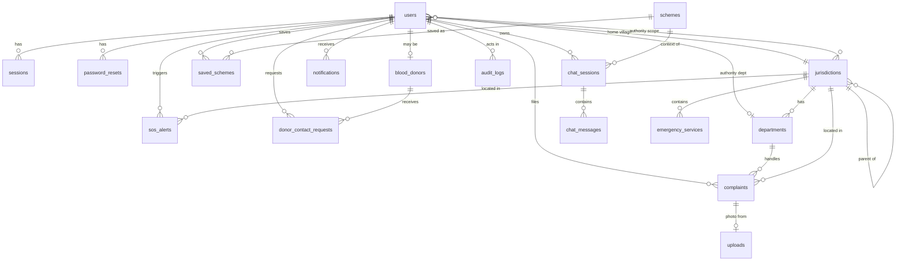

# Suraksha Setu — Backend Schema

| | |
|---|---|
| **Document** | 05 — Backend Schema (data model, auth, permissions, ownership) |
| **Version** | 1.0 (draft for team review) |
| **Date** | 26 September 2026 |
| **Database** | MongoDB Atlas (Mumbai), accessed through Mongoose 8 (Node API) and pymongo read-only (AI service) |
| **Related docs** | 02 TRD (APIs, auth tokens) · 03 App Flow (screens that use this data) |

---

## 1. Conventions

### 1.1 Relational terms → MongoDB terms
The brief asked for "tables, columns, primary keys and foreign keys". Suraksha Setu uses MongoDB, so this document uses the MongoDB equivalents:

| Relational | MongoDB (this doc) |
|---|---|
| Table | **Collection** |
| Row | **Document** |
| Column | **Field** |
| Primary key | `_id` (ObjectId, auto-generated), plus human-readable unique keys where useful (`complaintNo`, `slug`) |
| Foreign key | A field holding another document's `_id` (**ref**). Integrity is enforced in the application (Mongoose + service layer), not by the database. |
| Join | `populate()` or `$lookup` |
| Index / unique constraint | MongoDB index (`unique`, `partialFilterExpression`, `2dsphere`, `TTL`) |

### 1.2 Naming and common fields
- Collection names: `snake_case`, plural (`sos_alerts`). Field names: `camelCase`.
- Every collection has `_id`, `createdAt` and `updatedAt` (Mongoose `timestamps: true`) unless stated otherwise.
- All times are stored in **UTC** (`Date`) and displayed in IST.
- Enum values come from `shared/constants.json` (doc 02, section 2.4) and are stored as **lower_snake_case strings**, except complaint and SOS statuses, which are UPPER_CASE (matching the PRD and UI).
- "Ref → X" means the field stores an ObjectId pointing to collection X.

### 1.3 Reusable sub-schemas

**LocalizedText** — every piece of catalogue text shown to users.
| Field | Type | Required | Notes |
|---|---|---|---|
| `hi` | String | ✅ | Hindi |
| `en` | String | ✅ | English |

**GeoPoint** — GeoJSON point (note the order: **longitude first**).
| Field | Type | Required | Notes |
|---|---|---|---|
| `type` | String | ✅ | Always `"Point"` |
| `coordinates` | [Number, Number] | ✅ | `[lng, lat]`, lng −180…180, lat −90…90 |

**EmergencyContact** (embedded in `users`)
| Field | Type | Required | Notes |
|---|---|---|---|
| `_id` | ObjectId | auto | Needed for edit/delete |
| `name` | String (1–60) | ✅ | |
| `relation` | Enum: `mother, father, husband, wife, brother, sister, son, daughter, friend, other` | ✅ | |
| `phone` | String (E.164 `+91XXXXXXXXXX`) | ✅ | Can't equal the user's own phone. Unique within the array. |
| `email` | String (lowercase) | — | Enables email alerts |

**TimelineEvent** (embedded in `complaints`)
| Field | Type | Required | Notes |
|---|---|---|---|
| `_id` | ObjectId | auto | |
| `type` | Enum: `created, status_change, assigned, category_changed, public_note, internal_note, reopened, resolution_photo` | ✅ | |
| `fromStatus` / `toStatus` | Enum (complaint status) | — | For `status_change`, `reopened` |
| `text` | String (≤ 1000) | — | Note or reason |
| `visibility` | Enum: `public, internal` | ✅ | Citizens only ever receive `public` events |
| `actorId` | Ref → users | — | Null for system events |
| `actorRole` | Enum: `citizen, authority, admin, system` | ✅ | |
| `meta` | Object | — | e.g. `{ departmentId, assigneeId }` or `{ fromCategory, toCategory }` |
| `at` | Date | ✅ | |

**LocationPoint** (embedded in `sos_alerts.locationHistory`)
| Field | Type | Required |
|---|---|---|
| `point` | GeoPoint | ✅ |
| `accuracyM` | Number | — |
| `at` | Date | ✅ |

---

## 2. Entity-relationship diagram



---

## 3. Collections at a glance

| # | Collection | Purpose | Owner of each document | Expected size (pilot) |
|---|---|---|---|---|
| 5.1 | `users` | Accounts for citizens, authorities, admins, with embedded emergency contacts | The user | < 500 |
| 5.2 | `sessions` | Refresh-token sessions | The user | < 2,000 (TTL) |
| 5.3 | `password_resets` | Email reset tokens and admin-issued codes | System | tiny (TTL) |
| 5.4 | `jurisdictions` | State → district → block → gram panchayat → village tree | Admin | < 50 |
| 5.5 | `departments` | Departments per jurisdiction + category routing | Admin | < 30 |
| 5.6 | `complaints` | Civic complaints with an embedded timeline | Citizen (creator); managed by in-scope authorities | < 1,000 |
| 5.7 | `uploads` | Photos uploaded but not yet attached to a complaint | Uploader | tiny (cleaned hourly) |
| 5.8 | `schemes` | Government scheme catalogue (bilingual) + eligibility rules | Admin | 15–50 |
| 5.9 | `saved_schemes` | User bookmarks + document checklist | The user | < 2,000 |
| 5.10 | `sos_alerts` | SOS events with location trail | The user; visible to in-scope authorities | < 500 |
| 5.11 | `blood_donors` | Donor profiles (1 per user max) | The user | < 300 |
| 5.12 | `donor_contact_requests` | Log of donor phone reveals (abuse prevention) | System | < 2,000 (TTL) |
| 5.13 | `emergency_services` | Curated directory of hospitals, police, etc. | Admin | < 200 |
| 5.14 | `chat_sessions` | Sahayak conversations | The user | < 3,000 (TTL) |
| 5.15 | `chat_messages` | Messages inside Sahayak sessions | The user | < 50,000 (TTL) |
| 5.16 | `notifications` | In-app notifications | Recipient | < 10,000 (TTL) |
| 5.17 | `audit_logs` | Every authority/admin write action | System | < 20,000 |
| 5.18 | `usage_events` | Anonymous-friendly product metrics for the PRD success metrics | System | < 100,000 (TTL) |
| 5.19 | `counters` | Sequences for human-readable IDs | System | tiny |

---

## 4. Enumerations (in `shared/constants.json`)

| Name | Values |
|---|---|
| `roles` | `citizen`, `authority`, `admin` |
| `userStatus` | `active`, `inactive`, `deleted` |
| `languages` | `hi`, `en` |
| `textSizes` | `sm`, `md`, `lg` |
| `genders` | `female`, `male`, `other`, `undisclosed` |
| `jurisdictionTypes` | `state`, `district`, `block`, `gram_panchayat`, `village` |
| `complaintCategories` | `road_damage`, `garbage`, `streetlight`, `waterlogging`, `water_supply`, `encroachment`, `other` |
| `complaintStatus` | `SUBMITTED`, `VERIFIED`, `ASSIGNED`, `IN_PROGRESS`, `RESOLVED`, `REJECTED` |
| `timelineTypes` | `created`, `status_change`, `assigned`, `category_changed`, `public_note`, `internal_note`, `reopened`, `resolution_photo` |
| `categorySource` | `ai_accepted`, `user_selected`, `authority_corrected` |
| `rejectionReasons` | `duplicate`, `not_civic_issue`, `outside_area`, `inappropriate`, `other` |
| `sosStatus` | `ACTIVE`, `ACKNOWLEDGED`, `RESOLVED_SAFE`, `RESOLVED_BY_AUTHORITY`, `FALSE_ALARM`, `AUTO_CLOSED` |
| `sosLocationSource` | `gps`, `last_known`, `village` |
| `sosCloseOutcomes` | `citizen_safe_confirmed`, `responder_reached`, `false_alarm`, `could_not_reach` |
| `bloodGroups` | `A+`, `A-`, `B+`, `B-`, `AB+`, `AB-`, `O+`, `O-` |
| `serviceTypes` | `hospital`, `phc_chc`, `police`, `ambulance`, `fire`, `pharmacy`, `blood_bank` |
| `schemeCategories` | `women`, `farmers`, `health`, `housing`, `education`, `pension`, `employment`, `social_security`, `financial_inclusion` |
| `schemeLevels` | `central`, `state` |
| `chatModes` | `general`, `scheme_help`, `letter` |
| `letterTypes` | `panchayat_complaint`, `bdo_application`, `certificate_application`, `general_application` |
| `chatIntents` | `answer`, `need_info`, `letter_ready`, `emergency`, `out_of_scope` |
| `notificationTypes` | `complaint_submitted`, `complaint_status`, `complaint_note`, `complaint_reopened`, `sos_acknowledged`, `sos_closed`, `scheme_updated`, `donor_number_viewed`, `scheme_verification_due`, `system` |
| Eligibility answer enums | See 5.8.3 |

---

## 5. Collection specifications

### 5.1 `users`

| Field | Type | Req. | Default | Notes |
|---|---|---|---|---|
| `_id` | ObjectId | PK | auto | |
| `name` | String (2–60) | ✅ | | Trimmed |
| `phone` | String (E.164) | ✅* | | **Unique** among non-deleted users. Set to `null` on account deletion. |
| `phoneVerified` | Boolean | | `false` | Reserved for future OTP |
| `email` | String (lowercase) | | `null` | Unique when present (partial index) |
| `passwordHash` | String | ✅ | | bcrypt, cost 12. **Never selected by default** (`select: false`). |
| `role` | Enum `roles` | ✅ | `citizen` | |
| `status` | Enum `userStatus` | ✅ | `active` | |
| `language` | Enum `languages` | ✅ | `hi` | |
| `textSize` | Enum `textSizes` | ✅ | `md` | |
| `gender` | Enum `genders` | | `null` | Optional. Used for scheme matching only. |
| `jurisdictionId` | Ref → jurisdictions | ✅ | | Home village (for citizens). Used to route SOS/complaints when GPS is missing. |
| `villageOther` | String (≤ 80) | | `null` | When the village isn't in the list |
| `emergencyContacts` | [EmergencyContact] | | `[]` | **Max 5** (validator) |
| `authority` | Object | | `null` | Only for `authority`/`admin` roles ↓ |
| `authority.title` | String (≤ 80) | | | e.g. "Panchayat Secretary" |
| `authority.jurisdictionIds` | [Ref → jurisdictions] | ✅ (authority) | | Scope. A block-level ID covers every village under it. |
| `authority.departmentId` | Ref → departments | | `null` | `null` = all departments in scope |
| `mustChangePassword` | Boolean | | `false` | `true` for admin-created accounts |
| `tokenVersion` | Number | ✅ | `0` | Increment to invalidate all access tokens |
| `failedLoginCount` | Number | | `0` | Reset on success |
| `lockedUntil` | Date | | `null` | Set after 10 failures (30 min) |
| `lastLoginAt` | Date | | | |
| `consent` | Object | ✅ | | `{ version: "2026-09-v1", acceptedAt: Date }` |
| `eligibilityAnswers` | Object | | `null` | Only if the user chooses to save them (5.8.3 shape) + `savedAt` |
| `deletedAt` | Date | | `null` | Soft delete |
| `createdAt` / `updatedAt` | Date | auto | | |

**Indexes**
- `{ phone: 1 }` unique, `partialFilterExpression: { phone: { $type: "string" } }`
- `{ email: 1 }` unique, `partialFilterExpression: { email: { $type: "string" } }`
- `{ role: 1, status: 1 }`
- `{ "authority.jurisdictionIds": 1, "authority.departmentId": 1 }` (find officers for routing/notifications)
- `{ jurisdictionId: 1 }`

---

### 5.2 `sessions` (refresh tokens)

| Field | Type | Req. | Notes |
|---|---|---|---|
| `_id` | ObjectId | PK | |
| `userId` | Ref → users | ✅ | |
| `tokenHash` | String | ✅ | SHA-256 of (refresh token + `REFRESH_TOKEN_PEPPER`). **Unique.** |
| `familyId` | String (UUID) | ✅ | Same across rotations of one login. Used for reuse detection. |
| `replacedBy` | ObjectId | | Next session in the family after rotation |
| `revokedAt` | Date | | Set on rotation, logout or reuse detection |
| `userAgent` | String (≤ 200) | | For "your devices" (future) |
| `ipPrefix` | String | | First 3 octets only (privacy) |
| `lastUsedAt` | Date | ✅ | |
| `expiresAt` | Date | ✅ | Citizen: +30 days; authority/admin: +12 hours |

**Indexes:** `{ tokenHash: 1 }` unique · `{ userId: 1 }` · `{ familyId: 1 }` · `{ expiresAt: 1 }` **TTL** (`expireAfterSeconds: 0`).

---

### 5.3 `password_resets`

| Field | Type | Req. | Notes |
|---|---|---|---|
| `_id` | ObjectId | PK | |
| `userId` | Ref → users | ✅ | |
| `kind` | Enum: `email_token`, `admin_code` | ✅ | |
| `secretHash` | String | ✅ | SHA-256 of the token/code |
| `issuedBy` | Ref → users | | Admin who issued the code |
| `attempts` | Number | | Max 5, then invalidated |
| `usedAt` | Date | | Single use |
| `expiresAt` | Date | ✅ | +30 minutes |

**Indexes:** `{ userId: 1, kind: 1 }` · `{ expiresAt: 1 }` **TTL**.

---

### 5.4 `jurisdictions`

| Field | Type | Req. | Notes |
|---|---|---|---|
| `_id` | ObjectId | PK | |
| `name` | LocalizedText | ✅ | |
| `type` | Enum `jurisdictionTypes` | ✅ | |
| `parentId` | Ref → jurisdictions | | `null` only for the state |
| `ancestors` | [Ref → jurisdictions] | ✅ | All parents from the root, e.g. `[MP, Sehore district, Sehore block, GP]`. Maintained on save. |
| `lgdCode` | String | | Local Government Directory code, if known |
| `centroid` | GeoPoint | ✅ | Fallback location for SOS/complaints |
| `boundary` | GeoJSON Polygon/MultiPolygon | | Optional. Used to auto-detect the jurisdiction from GPS. |
| `defaultDepartmentId` | Ref → departments | | Routing fallback |
| `active` | Boolean | ✅ | `true` |

**Indexes:** `{ parentId: 1 }` · `{ ancestors: 1 }` · `{ type: 1 }` · `{ centroid: "2dsphere" }` · `{ boundary: "2dsphere" }` (sparse).

**Resolving the jurisdiction of a point:** (1) `boundary` `$geoIntersects` at the village level; (2) if there's no match, the nearest village `centroid` within 5 km (`$near`); (3) otherwise the user's home `jurisdictionId`.

---

### 5.5 `departments`

| Field | Type | Req. | Notes |
|---|---|---|---|
| `_id` | ObjectId | PK | |
| `name` | LocalizedText | ✅ | e.g. `{ hi: "ग्राम पंचायत महोदिया", en: "Gram Panchayat Mahodiya" }` |
| `code` | String | ✅ | e.g. `GP_MAHODIYA`, `PHED_SEHORE`. Unique. |
| `jurisdictionId` | Ref → jurisdictions | ✅ | The level it serves (village/GP for Panchayat; block/district for PHED/PWD) |
| `handlesCategories` | [Enum `complaintCategories`] | ✅ | Used for routing |
| `contactPhone` | String | | |
| `contactEmail` | String | | |
| `active` | Boolean | ✅ | `true` |

**Indexes:** `{ code: 1 }` unique · `{ jurisdictionId: 1, handlesCategories: 1 }`.

**Routing algorithm:** given a complaint's `jurisdictionAncestors` (village first, going up), pick the first **active** department whose `jurisdictionId` is in that list (nearest level first) and whose `handlesCategories` contains the category. If there's none, use the village's `defaultDepartmentId`, then the GP's default.

---

### 5.6 `complaints`

| Field | Type | Req. | Default | Notes |
|---|---|---|---|---|
| `_id` | ObjectId | PK | | |
| `complaintNo` | String | ✅ | | `SS-<year>-<6-digit seq>` from `counters`. **Unique.** |
| `citizenId` | Ref → users | | | Creator. Set to `null` if the account is deleted (complaint stays, anonymised). |
| `onBehalfOf` | Object | | `null` | `{ name: String ≤ 60, phone: String E.164? }` |
| `category` | Enum `complaintCategories` | ✅ | | Current category |
| `categorySource` | Enum `categorySource` | ✅ | | How the current category was set |
| `aiSuggestion` | Object | | `null` | `{ category, confidence (0–1), top3: [{category, confidence}], modelVersion, inferenceMs }` — kept even if the user changed it (training data) |
| `description` | String (≤ 500) | | | |
| `landmark` | String (≤ 100) | | | |
| `location` | GeoPoint | ✅ | | |
| `locationAccuracyM` | Number | | | |
| `jurisdictionId` | Ref → jurisdictions | ✅ | | Resolved village |
| `jurisdictionAncestors` | [Ref → jurisdictions] | ✅ | | `[village, ...ancestors]` — **used for authority scoping** |
| `departmentId` | Ref → departments | ✅ | | From routing; the authority can change it |
| `assigneeId` | Ref → users | | `null` | Specific officer (optional) |
| `status` | Enum `complaintStatus` | ✅ | `SUBMITTED` | |
| `statusChangedAt` | Date | ✅ | | |
| `imageUrl` | String (Cloudinary HTTPS URL) | | | Absent if filed without a photo |
| `imagePublicId` | String | | | For deletion |
| `resolutionImageUrl` / `resolutionImagePublicId` | String | | | |
| `rejection` | Object | | `null` | `{ code: Enum rejectionReasons, text: String ≤ 300 }` |
| `reopenCount` | Number | ✅ | `0` | Max 2 reopens |
| `resolvedAt` | Date | | | Last time it entered RESOLVED |
| `firstActionAt` | Date | | | First authority action (for "time to first response") |
| `timeline` | [TimelineEvent] | ✅ | `[created]` | Append-only. Max 200 events. |
| `supportCount` | Number | | `0` | P2 "+1" feature |
| `createdAt` / `updatedAt` | Date | auto | | |

**Indexes**
- `{ complaintNo: 1 }` unique
- `{ citizenId: 1, createdAt: -1 }` — "My complaints"
- `{ jurisdictionAncestors: 1, status: 1, createdAt: -1 }` — authority table
- `{ departmentId: 1, status: 1 }`
- `{ category: 1, createdAt: -1 }` — analytics
- `{ location: "2dsphere" }` — duplicate hints (P2) and maps
- `{ status: 1, statusChangedAt: 1 }` — overdue checks

#### 5.6.1 Status transitions (enforced in the service layer)

| From | To | Who | Required input | Side effects |
|---|---|---|---|---|
| (new) | `SUBMITTED` | Citizen | — | Timeline `created`; notify citizen; `complaint:new` to scope |
| `SUBMITTED` | `VERIFIED` | Authority/Admin | — | Sets `firstActionAt` if empty |
| `SUBMITTED` / `VERIFIED` | `REJECTED` | Authority/Admin | `rejection.code` (+ text if `other`) | Notify citizen with the reason |
| `VERIFIED` | `ASSIGNED` | Authority/Admin | `departmentId` (+ optional `assigneeId`) | Timeline `assigned` |
| `ASSIGNED` | `ASSIGNED` (reassign) | Authority/Admin | new `departmentId`/`assigneeId` | Timeline `assigned` |
| `ASSIGNED` | `IN_PROGRESS` | Authority/Admin | — | |
| `IN_PROGRESS` | `ASSIGNED` (reassign) | Authority/Admin | new `departmentId`/`assigneeId` | |
| `IN_PROGRESS` | `RESOLVED` | Authority/Admin | public note (required) | Sets `resolvedAt`; notify citizen |
| `RESOLVED` | `ASSIGNED` (reopen) | **Owner citizen only** | reason ≥ 10 chars; within **7 days** of `resolvedAt`; `reopenCount < 2` | `reopenCount++`; timeline `reopened`; alert scope |
| `REJECTED` | `SUBMITTED` (restore) | **Admin only** | note | |

Any other transition returns `409 CONFLICT`. Updates use an **optimistic check**: `findOneAndUpdate({ _id, status: expectedFromStatus }, …)`. If nothing matched, someone else changed it first → 409 (the UI reloads).

---

### 5.7 `uploads`

| Field | Type | Req. | Notes |
|---|---|---|---|
| `_id` | ObjectId | PK | Returned to the client as `uploadId` |
| `userId` | Ref → users | ✅ | Only this user can attach it |
| `purpose` | Enum: `complaint`, `resolution` | ✅ | |
| `imageUrl` / `publicId` | String | ✅ | Cloudinary |
| `bytes`, `width`, `height` | Number | | |
| `aiSuggestion` | Object | | Same shape as in complaints. **Copied into the complaint on create** (the client can't forge it). |
| `status` | Enum: `pending`, `attached` | ✅ | |
| `attachedTo` | Ref → complaints | | |

**Indexes:** `{ userId: 1, status: 1 }` · `{ status: 1, createdAt: 1 }`.
**Cleanup job (hourly):** find `pending` uploads older than 24 h → delete the Cloudinary asset → delete the document.

---

### 5.8 `schemes`

| Field | Type | Req. | Notes |
|---|---|---|---|
| `_id` | ObjectId | PK | |
| `slug` | String (kebab-case) | ✅ | **Unique**, from the English name, e.g. `pm-kisan` |
| `name` | LocalizedText | ✅ | |
| `summary` | LocalizedText | ✅ | 1–2 sentences, plain language |
| `benefitShort` | LocalizedText | ✅ | One line for cards |
| `benefits` | [LocalizedText] | ✅ | |
| `eligibilityText` | [LocalizedText] | ✅ | Human-readable conditions |
| `rules` | EligibilityRules (5.8.2) | | Machine-checkable version. If absent, the checker returns `maybe` with "check at office". |
| `documents` | [{ `key`: String, `label`: LocalizedText, `icon`: String }] | ✅ | `key` examples: `aadhaar`, `ration_card`, `bank_passbook`, `photo`, `income_cert`, `caste_cert`, `land_record`, `samagra_id` |
| `howToApply` | [LocalizedText] | ✅ | Ordered steps |
| `whereToApply` | [LocalizedText] | ✅ | |
| `officialUrl` | String (https) | ✅ | |
| `sourceName` | String | ✅ | e.g. "myScheme (Govt. of India)", "MP Govt. portal" |
| `helpline` | String | | |
| `categories` | [Enum `schemeCategories`] | ✅ | |
| `level` | Enum `schemeLevels` | ✅ | |
| `state` | String | | `"MP"` for state schemes |
| `tags` | [String] | | Search helpers in both scripts, e.g. `["kisan", "किसान", "6000"]` |
| `status` | Enum: `draft`, `published` | ✅ | |
| `publishedAt` | Date | | |
| `lastVerifiedAt` | Date | ✅ (to publish) | Shown on S-15. A warning is shown if > 90 days. |
| `verifiedBy` | Ref → users | | |
| `createdBy` / `updatedBy` | Ref → users | ✅ | |
| `version` | Number | ✅ | Incremented on each publish. Saved-scheme users are notified when it increases. |

**Indexes:** `{ slug: 1 }` unique · `{ status: 1, categories: 1 }` · `{ lastVerifiedAt: 1 }`.
**Search:** the catalogue is small, so the API loads published schemes into memory (cache 5 minutes, busted on publish) and filters by normalised name/tags. No text index is needed (MongoDB's text index has no Hindi stemming anyway).

#### 5.8.1 How the checker evaluates a scheme
Each condition evaluates to **true**, **false** or **unknown** (the answer is missing or "don't know").
- Any condition **false** → `no` (the reason is that condition's `failReason`).
- All conditions **true** and no `alwaysCheck` notes → `likely`.
- Otherwise → `maybe` (reasons = unknown conditions' `unknownReason` + `alwaysCheck` notes).

#### 5.8.2 EligibilityRules shape
```json
{
  "all": [
    { "field": "gender", "op": "eq", "value": "female",
      "failReason": { "hi": "यह योजना महिलाओं के लिए है", "en": "This scheme is for women" } },
    { "field": "ageBand", "op": "in", "value": ["21_40", "41_60"],
      "failReason": { "hi": "उम्र 21 से 60 साल होनी चाहिए", "en": "Age must be 21 to 60" } },
    { "field": "incomeBand", "op": "in", "value": ["lt_1l", "1l_2_5l"],
      "unknownReason": { "hi": "परिवार की आय जाँची जाएगी", "en": "Family income will be checked" },
      "failReason": { "hi": "परिवार की आय सीमा से ज़्यादा है", "en": "Family income is above the limit" } }
  ],
  "any": [],
  "alwaysCheck": [
    { "hi": "समग्र आईडी ज़रूरी है", "en": "Samagra ID is required" }
  ]
}
```
- `op`: `eq`, `neq`, `in`, `nin`.
- `any`: at least one must be true (same true/false/unknown logic applied as an OR).

#### 5.8.3 Eligibility answer fields (questionnaire → rules)

| Field | Values |
|---|---|
| `forWhom` | `self`, `family_member` |
| `gender` | `female`, `male`, `other` |
| `ageBand` | `lt_18`, `18_20`, `21_40`, `41_60`, `gt_60` |
| `maritalStatus` | `married`, `widowed`, `divorced_separated`, `unmarried` (asked only for women 21–60) |
| `occupation` | `farmer_own_land`, `farmer_no_land`, `labourer`, `homemaker`, `student`, `self_employed`, `salaried`, `none` |
| `incomeBand` | `lt_1l`, `1l_2_5l`, `2_5l_5l`, `gt_5l`, `dont_know` |
| `socialCategory` | `sc`, `st`, `obc`, `general`, `undisclosed` |
| `rationCard` | `bpl_antyodaya`, `other`, `none`, `dont_know` |
| `disability` | `yes`, `no` |

`dont_know` and `undisclosed` count as **unknown**.

---

### 5.9 `saved_schemes`

| Field | Type | Req. | Notes |
|---|---|---|---|
| `_id` | ObjectId | PK | |
| `userId` | Ref → users | ✅ | |
| `schemeId` | Ref → schemes | ✅ | |
| `checkedDocuments` | [String] | | Document `key`s ticked by the user |
| `seenVersion` | Number | ✅ | Scheme version when last viewed. Used for "updated" notifications. |

**Indexes:** `{ userId: 1, schemeId: 1 }` unique · `{ schemeId: 1 }`.

---

### 5.10 `sos_alerts`

| Field | Type | Req. | Default | Notes |
|---|---|---|---|---|
| `_id` | ObjectId | PK | | |
| `userId` | Ref → users | ✅ | | |
| `status` | Enum `sosStatus` | ✅ | `ACTIVE` | |
| `startLocation` | GeoPoint | ✅ | | |
| `lastLocation` | GeoPoint | ✅ | | Updated on every location push |
| `lastAccuracyM` | Number | | | |
| `locationSource` | Enum `sosLocationSource` | ✅ | | |
| `locationHistory` | [LocationPoint] | ✅ | `[]` | Capped at **720 points** (`$push` with `$slice: -720`) |
| `jurisdictionId` | Ref → jurisdictions | ✅ | | Resolved from the location, else home village |
| `jurisdictionAncestors` | [Ref → jurisdictions] | ✅ | | For authority scoping |
| `contactsSnapshot` | [{ name, relation, phone, email }] | ✅ | | Copy of the contacts at trigger time (contacts may be edited later) |
| `emailedTo` | [String] | | `[]` | Emails successfully sent |
| `trackTokenHash` | String | ✅ | | SHA-256 of the public tracking token |
| `trackTokenExpiresAt` | Date | ✅ | | Earlier of: resolve time, trigger + 24 h |
| `acknowledgedBy` / `acknowledgedAt` | Ref → users / Date | | | |
| `closedBy` | Ref → users | | | Authority who closed it |
| `closeOutcome` | Enum `sosCloseOutcomes` | | | |
| `closeNote` | String (≤ 500) | | | |
| `resolvedAt` | Date | | | |
| `triggeredAt` | Date | ✅ | | Client time if queued offline; the server keeps `createdAt` as well |
| `lastUpdateAt` | Date | ✅ | | |
| `flaggedForReview` | Boolean | | `false` | `true` if > 3 SOS in 1 hour from this user |
| `createdVia` | Enum: `online`, `offline_retry` | ✅ | `online` | |

**Indexes**
- `{ userId: 1, status: 1 }` — "do I have an active SOS?"
- `{ jurisdictionAncestors: 1, status: 1, triggeredAt: -1 }` — authority live map
- `{ trackTokenHash: 1 }` unique
- `{ status: 1, lastUpdateAt: 1 }` — auto-close job
- `{ lastLocation: "2dsphere" }`

**Rule:** only one SOS in `ACTIVE`/`ACKNOWLEDGED` per user. Enforced in the service (check before insert) **and** by a unique partial index `{ userId: 1 }` with `partialFilterExpression: { status: { $in: ["ACTIVE", "ACKNOWLEDGED"] } }`.

**Status rules:** `ACTIVE → ACKNOWLEDGED` (authority) · `ACTIVE/ACKNOWLEDGED → RESOLVED_SAFE` (owner; becomes `FALSE_ALARM` instead if within 60 s of trigger) · `→ RESOLVED_BY_AUTHORITY` (authority close) · `→ AUTO_CLOSED` (job: no update for 6 h).

---

### 5.11 `blood_donors`

| Field | Type | Req. | Default | Notes |
|---|---|---|---|---|
| `_id` | ObjectId | PK | | |
| `userId` | Ref → users | ✅ | | **Unique** (one donor profile per user) |
| `bloodGroup` | Enum `bloodGroups` | ✅ | | |
| `lastDonatedAt` | Date | | `null` | Not in the future |
| `eligibleFrom` | Date | ✅ | | `lastDonatedAt + 90 days`, or `createdAt` if never donated. Recomputed on save. |
| `available` | Boolean | ✅ | `true` | |
| `location` | GeoPoint | ✅ | | |
| `jurisdictionId` | Ref → jurisdictions | ✅ | | |
| `displayName` | String | ✅ | | "First L." computed from the user's name (no full names in search) |
| `consentAt` | Date | ✅ | | |

**Indexes:** `{ userId: 1 }` unique · `{ location: "2dsphere", bloodGroup: 1, available: 1, eligibleFrom: 1 }` (compound for `$geoNear` with a filter).

**Search query:** `$geoNear` on `location`, `maxDistance = radiusKm × 1000`, query `{ bloodGroup: { $in: compatibleGroups }, available: true, eligibleFrom: { $lte: now }, userId: { $ne: requesterId } }`, limit 50. The phone is **not** in this collection; the API joins it only in `/reveal`.

**Compatible donors for a recipient** (in `shared/constants.json`):
`O-`: O- · `O+`: O+, O- · `A-`: A-, O- · `A+`: A+, A-, O+, O- · `B-`: B-, O- · `B+`: B+, B-, O+, O- · `AB-`: AB-, A-, B-, O- · `AB+`: all.

---

### 5.12 `donor_contact_requests`

| Field | Type | Req. | Notes |
|---|---|---|---|
| `_id` | ObjectId | PK | |
| `requesterId` | Ref → users | ✅ | |
| `donorId` | Ref → blood_donors | ✅ | |
| `bloodGroupSearched` | Enum `bloodGroups` | ✅ | |
| `createdAt` | Date | ✅ | |

**Indexes:** `{ requesterId: 1, createdAt: -1 }` (daily limit = 10) · `{ donorId: 1, createdAt: -1 }` ("viewed your number" count) · `{ createdAt: 1 }` **TTL 180 days**.

---

### 5.13 `emergency_services`

| Field | Type | Req. | Notes |
|---|---|---|---|
| `_id` | ObjectId | PK | |
| `name` | LocalizedText | ✅ | |
| `type` | Enum `serviceTypes` | ✅ | |
| `address` | LocalizedText | ✅ | |
| `phones` | [String] | ✅ | At least 1. Landline numbers allowed (with STD code). |
| `location` | GeoPoint | ✅ | |
| `jurisdictionId` | Ref → jurisdictions | ✅ | |
| `is24x7` | Boolean | | |
| `notes` | LocalizedText | | e.g. "Blood bank available" |
| `verifiedAt` / `verifiedBy` | Date / Ref → users | ✅ | Verified by calling or visiting |
| `active` | Boolean | ✅ | |

**Indexes:** `{ location: "2dsphere", type: 1, active: 1 }` · `{ jurisdictionId: 1 }`.
National helplines (112, 108, …) are **not** stored here. They're static in `shared/constants.json` so they work offline.

---

### 5.14 `chat_sessions`

| Field | Type | Req. | Notes |
|---|---|---|---|
| `_id` | ObjectId | PK | |
| `userId` | Ref → users | ✅ | |
| `mode` | Enum `chatModes` | ✅ | |
| `schemeId` | Ref → schemes | | For `scheme_help` |
| `letterType` | Enum `letterTypes` | | For `letter` |
| `title` | String (≤ 80) | ✅ | The first user message, truncated |
| `messageCount` | Number | ✅ | |
| `lastMessageAt` | Date | ✅ | |
| `expireAt` | Date | ✅ | `lastMessageAt + 90 days` (updated on each message) |

**Indexes:** `{ userId: 1, lastMessageAt: -1 }` · `{ expireAt: 1 }` **TTL**.

### 5.15 `chat_messages`

| Field | Type | Req. | Notes |
|---|---|---|---|
| `_id` | ObjectId | PK | |
| `sessionId` | Ref → chat_sessions | ✅ | |
| `userId` | Ref → users | ✅ | Denormalised for the daily-limit query and ownership checks |
| `role` | Enum: `user`, `assistant`, `notice` | ✅ | `notice` = system-inserted cards (emergency, limit reached) |
| `text` | String (≤ 4000) | ✅ | |
| `intent` | Enum `chatIntents` | | Assistant only |
| `cards` | [{ `type`: `scheme`, `slug`: String }] | | |
| `letter` | Object | | `{ to, subject, body, place, date, applicantName, mobile? }` when `intent = letter_ready` |
| `letterEdited` | Object | | Same shape, if the user edited the letter on S-26 |
| `llm` | Object | | `{ provider, model, tokensIn, tokensOut, latencyMs }` (assistant only, for cost tracking) |
| `expireAt` | Date | ✅ | Same as the session |

**Indexes:** `{ sessionId: 1, createdAt: 1 }` · `{ userId: 1, role: 1, createdAt: -1 }` (daily limit: count `role = user` since IST midnight) · `{ expireAt: 1 }` **TTL**.

---

### 5.16 `notifications`

| Field | Type | Req. | Notes |
|---|---|---|---|
| `_id` | ObjectId | PK | |
| `recipientId` | Ref → users | ✅ | |
| `type` | Enum `notificationTypes` | ✅ | |
| `templateKey` | String | ✅ | i18n key, e.g. `notif.complaintStatus` (rendered in the reader's current language) |
| `params` | Object | | e.g. `{ complaintNo, status }` |
| `link` | String | | In-app route, e.g. `/complaints/66f…` |
| `readAt` | Date | | |
| `expireAt` | Date | ✅ | `createdAt + 180 days` |

**Indexes:** `{ recipientId: 1, readAt: 1, createdAt: -1 }` · `{ expireAt: 1 }` **TTL**.

---

### 5.17 `audit_logs`

| Field | Type | Req. | Notes |
|---|---|---|---|
| `_id` | ObjectId | PK | |
| `actorId` | Ref → users | ✅ | |
| `actorRole` | Enum `roles` | ✅ | |
| `action` | String | ✅ | Dotted verb, e.g. `complaint.status_changed`, `complaint.phone_revealed`, `sos.acknowledged`, `scheme.published`, `user.created`, `user.reset_code_issued` |
| `targetType` | String | ✅ | Collection name |
| `targetId` | ObjectId | ✅ | |
| `changes` | Object | | `{ field: [before, after] }` (no passwords/tokens) |
| `ipPrefix` | String | | |
| `createdAt` | Date | ✅ | |

**Indexes:** `{ createdAt: -1 }` · `{ actorId: 1, createdAt: -1 }` · `{ targetType: 1, targetId: 1 }`. Retained 2 years (a monthly job deletes older entries). **Insert-only:** no update/delete endpoints.

---

### 5.18 `usage_events`

| Field | Type | Req. | Notes |
|---|---|---|---|
| `_id` | ObjectId | PK | |
| `type` | Enum: `scheme_view`, `eligibility_completed`, `letter_generated`, `complaint_ai_accepted`, `complaint_ai_changed`, `sos_triggered`, `emergency_call_tap`, `donor_search`, `app_install` | ✅ | |
| `userId` | Ref → users | | `null` for logged-out actions |
| `anonId` | String | | Random per-device ID (no fingerprinting) |
| `jurisdictionId` | Ref → jurisdictions | | |
| `props` | Object | | e.g. `{ schemeId }`, `{ likelyCount: 4 }`. **No free text and no answers.** |
| `createdAt` | Date | ✅ | |

**Indexes:** `{ type: 1, createdAt: -1 }` · `{ createdAt: 1 }` **TTL 365 days**.

---

### 5.19 `counters`

| Field | Type | Notes |
|---|---|---|
| `_id` | String | e.g. `complaint:2026` |
| `seq` | Number | Incremented atomically: `findOneAndUpdate({ _id }, { $inc: { seq: 1 } }, { upsert: true, new: true })` |

---

## 6. Index summary

| Collection | Index | Type |
|---|---|---|
| users | `phone` | unique, partial (string) |
| users | `email` | unique, partial (string) |
| users | `role, status` / `authority.jurisdictionIds, authority.departmentId` / `jurisdictionId` | normal |
| sessions | `tokenHash` | unique |
| sessions | `userId` / `familyId` | normal |
| sessions | `expiresAt` | TTL |
| password_resets | `expiresAt` | TTL |
| jurisdictions | `centroid`, `boundary` | 2dsphere |
| jurisdictions | `parentId` / `ancestors` / `type` | normal |
| departments | `code` | unique |
| departments | `jurisdictionId, handlesCategories` | normal |
| complaints | `complaintNo` | unique |
| complaints | `citizenId, createdAt` / `jurisdictionAncestors, status, createdAt` / `departmentId, status` / `category, createdAt` / `status, statusChangedAt` | normal |
| complaints | `location` | 2dsphere |
| uploads | `userId, status` / `status, createdAt` | normal |
| schemes | `slug` | unique |
| schemes | `status, categories` / `lastVerifiedAt` | normal |
| saved_schemes | `userId, schemeId` | unique |
| sos_alerts | `trackTokenHash` | unique |
| sos_alerts | `userId` (status ACTIVE/ACKNOWLEDGED) | unique, partial |
| sos_alerts | `jurisdictionAncestors, status, triggeredAt` / `status, lastUpdateAt` | normal |
| sos_alerts | `lastLocation` | 2dsphere |
| blood_donors | `userId` | unique |
| blood_donors | `location, bloodGroup, available, eligibleFrom` | 2dsphere compound |
| donor_contact_requests | `requesterId, createdAt` / `donorId, createdAt` | normal |
| donor_contact_requests | `createdAt` | TTL 180 d |
| emergency_services | `location, type, active` | 2dsphere compound |
| chat_sessions | `userId, lastMessageAt` | normal |
| chat_sessions / chat_messages | `expireAt` | TTL |
| chat_messages | `sessionId, createdAt` / `userId, role, createdAt` | normal |
| notifications | `recipientId, readAt, createdAt` | normal |
| notifications | `expireAt` | TTL |
| audit_logs | `createdAt` / `actorId, createdAt` / `targetType, targetId` | normal |
| usage_events | `type, createdAt` | normal |
| usage_events | `createdAt` | TTL 365 d |

Indexes are declared in Mongoose schemas and created by a one-off `npm run db:indexes` script (`autoIndex: false` in production).

---

## 7. Authentication and session handling

### 7.1 Registration
1. Validate input (Zod). Normalise the phone to E.164.
2. Check the phone isn't taken (the unique index is the final guard → 409).
3. `passwordHash = bcrypt(password, 12)`. Store `consent.version` + `acceptedAt`.
4. Create a session (7.2) and return the access token + refresh cookie.

### 7.2 Login and tokens
1. Find the user by phone with `status: "active"`. If `lockedUntil > now` → 423 `ACCOUNT_LOCKED`.
2. Compare the password. On failure → `failedLoginCount++`; at 10 → `lockedUntil = now + 30 min`. Return the same 401 message whether the phone exists or not.
3. On success → reset counters, set `lastLoginAt`.
4. Generate a refresh token (32 random bytes, base64url). Insert a `sessions` doc with `tokenHash`, a new `familyId`, and `expiresAt` by role.
5. Sign the access token (15 min): `{ sub, role, jur: [jurisdictionIds], dept, ver: tokenVersion }`.
6. Set the cookie `ss_rt` (`httpOnly`, `Secure`, `SameSite=Lax`, `Path=/api/v1/auth`, `Max-Age` = session lifetime).

### 7.3 Refresh (rotation with reuse detection)
1. Hash the presented cookie → find the session.
2. **Not found** → 401.
3. **Found but `revokedAt` set** → this token was already used (possible theft) → revoke **all** sessions with the same `familyId` → 401.
4. **Expired** → 401.
5. Otherwise → create a new session (same `familyId`), set `revokedAt` + `replacedBy` on the old one, issue a new access token + cookie. The user must still be `active`, and the new access token carries the current `tokenVersion`.

### 7.4 Request authentication middleware
`Authorization: Bearer <access>` → verify the signature and expiry → load `{ _id, role, status, tokenVersion, authority }` for the user (cached 60 s in memory) → reject if `status ≠ active` or `ver ≠ tokenVersion` → attach `req.user`.

### 7.5 Logout / logout-all / password change
- Logout: revoke the current session; clear the cookie.
- Logout-all and password change/reset: `tokenVersion++` and revoke all of the user's sessions.
- Admin deactivation: `status = inactive`, `tokenVersion++`, revoke all sessions.

### 7.6 Socket authentication
The handshake `auth.token` is verified like 7.4. Rooms: `user:<id>` for everyone; `jur:<id>` for each of `authority.jurisdictionIds` (authority); `admin` (admin). Events for an SOS/complaint are emitted to `jur:<id>` for **every** ID in the document's `jurisdictionAncestors`, so block-level officers also receive them.

---

## 8. Permissions matrix

Legend: ✅ allowed · 🔒 own only · 🗺 in scope only (jurisdiction ∩ `jurisdictionAncestors`, and department if set) · ❌ denied · — not applicable

| Resource / action | Public | Citizen | Authority | Admin |
|---|---|---|---|---|
| Register / login | ✅ | — | — | — |
| Own profile read/update | ❌ | 🔒 | 🔒 | 🔒 |
| Other users read | ❌ | ❌ | ❌ (only names/masked phones inside in-scope complaints/SOS) | ✅ |
| Create authority/admin accounts, deactivate users | ❌ | ❌ | ❌ | ✅ |
| Emergency contacts CRUD | ❌ | 🔒 | ❌ | ❌ |
| SOS trigger / location / resolve | ❌ | 🔒 | ❌ | ❌ |
| SOS read | Track page only (first name, location, status) via valid token | 🔒 | 🗺 | ✅ |
| SOS acknowledge / close | ❌ | ❌ | 🗺 | ✅ |
| Reveal SOS user's / contacts' phone | ❌ | ❌ | 🗺 (audited) | ✅ (audited) |
| Complaint create | ❌ | ✅ | ❌ | ❌ |
| Complaint read | ❌ | 🔒 (public timeline only) | 🗺 (full) | ✅ |
| Complaint status / assign / notes / re-categorise | ❌ | ❌ | 🗺 | ✅ |
| Complaint reopen | ❌ | 🔒 (rules in 5.6.1) | ❌ | ❌ |
| Complaint restore from REJECTED | ❌ | ❌ | ❌ | ✅ |
| Complaints CSV export | ❌ | ❌ | 🗺 | ✅ |
| Reveal complainant phone | ❌ | ❌ | 🗺 (audited) | ✅ (audited) |
| Schemes read (published) | ✅ | ✅ | ✅ | ✅ |
| Schemes read (draft) / create / edit / publish / verify | ❌ | ❌ | ❌ | ✅ |
| Eligibility check | ✅ | ✅ | ✅ | ✅ |
| Saved schemes | ❌ | 🔒 | ❌ | ❌ |
| Donor profile CRUD | ❌ | 🔒 | ❌ | ✅ (remove only, for abuse) |
| Donor search (masked) | ❌ | ✅ | ❌ | ✅ |
| Donor phone reveal | ❌ | ✅ (10/day, logged) | ❌ | ✅ |
| Emergency helplines + nearby | ✅ | ✅ | ✅ | ✅ |
| Emergency directory CRUD | ❌ | ❌ | ❌ | ✅ |
| Departments / jurisdictions CRUD | ❌ | ❌ | ❌ (read in scope) | ✅ |
| Sahayak chat | ❌ | 🔒 | ❌ | ❌ |
| Notifications | ❌ | 🔒 | 🔒 | 🔒 |
| Analytics / overview | ❌ | ❌ | 🗺 | ✅ |
| Audit log read | ❌ | ❌ | ❌ | ✅ |
| Issue password reset code | ❌ | ❌ | ❌ | ✅ |

**Implementation pattern**
```js
router.patch("/complaints/:id/status",
  requireAuth,
  requireRole("authority", "admin"),
  validate(statusChangeSchema),
  complaintsController.changeStatus   // service calls assertInScope(req.user, complaint)
);

function assertInScope(user, doc) {
  if (user.role === "admin") return;
  const inJur = doc.jurisdictionAncestors.some(id =>
    user.authority.jurisdictionIds.some(j => j.equals(id)));
  const inDept = !user.authority.departmentId ||
    user.authority.departmentId.equals(doc.departmentId);
  if (!inJur || (doc.departmentId && !inDept)) throw new ForbiddenError();
}
```
- For list endpoints, scope is applied **in the query** (`{ jurisdictionAncestors: { $in: user.authority.jurisdictionIds }, ...(dept && { departmentId: dept }) }`), never by filtering afterwards.
- SOS scope ignores the department (every in-scope officer sees every SOS).

---

## 9. Data ownership rules

1. **Citizens own** their profile, emergency contacts, SOS alerts, complaints (as the creator), donor profile, saved schemes and chats. They can view, edit (where the UI allows) and delete them (via account deletion or per-item delete where available).
2. **Complaints are shared records.** Once submitted, the content (photo, category, location, description) **cannot be edited by the citizen** (so the authority's work isn't undermined); they can add information by reopening. The authority owns the *handling* (status, notes, department). On account deletion the complaint stays, with `citizenId = null` and `onBehalfOf` removed, so the public-service record remains.
3. **SOS data is the citizen's.** Authorities can see it only while it's in their scope and only for handling. Emergency contacts receive only what the track page shows.
4. **Donor data is the donor's.** It's never listed with full names or phone numbers. Reveals are logged and visible to the donor as a count.
5. **Catalogue data** (schemes, emergency services, departments, jurisdictions) is owned by admins. Each record keeps `createdBy/updatedBy/verifiedBy`.
6. **The AI service never writes** to the database. It has read-only access to `schemes` only.
7. **Contacts' data** (third parties) is used only for SOS alerts. We don't message contacts for anything else.
8. **Aggregates** (analytics) never expose individual records to users outside the permission matrix.

---

## 10. Retention and deletion

| Data | Kept for | Then |
|---|---|---|
| SOS `locationHistory` | 90 days after the SOS ends | History cleared; `startLocation` rounded to 3 decimals (~100 m); the document is kept 1 year for statistics, then deleted |
| SOS track token | Until resolve or 24 h | Invalid (hash kept, expiry passed) |
| Complaints | 3 years | Deleted with their Cloudinary images |
| Pending uploads | 24 h | Deleted (job) |
| Chat sessions/messages | 90 days after the last message | TTL delete |
| Notifications | 180 days | TTL delete |
| Donor contact requests | 180 days | TTL delete |
| Sessions | Until expiry | TTL delete |
| Password resets | 30 min | TTL delete |
| Usage events | 365 days | TTL delete |
| Audit logs | 2 years | Monthly job delete |

**Account deletion (`DELETE /users/me`)** — one transaction where possible:
1. `users`: `status = deleted`, `name = "Deleted user"`, `phone = null`, `email = null`, `emergencyContacts = []`, `eligibilityAnswers = null`, `gender = null`, `passwordHash` = random, `tokenVersion++`, `deletedAt = now`.
2. Delete: `sessions`, `blood_donors`, `saved_schemes`, `chat_sessions` + `chat_messages`, `notifications`, `donor_contact_requests` (as requester).
3. `sos_alerts`: clear `locationHistory`, `contactsSnapshot`, round the locations. Set `userId` to keep the counts, but the user is now anonymous.
4. `complaints`: `citizenId = null`, `onBehalfOf = null`.
5. Write an `audit_logs` entry (actor = the user, action `user.self_deleted`).

---

## 11. Seed data

### 11.1 Jurisdictions (confirm names and hierarchy during the field visit)
Madhya Pradesh (state) → Sehore (district) → Sehore (block / Janpad Panchayat) → Mahodiya (gram panchayat — **to confirm**) → Mahodiya (village; centroid from Google Maps, verified on site). Add 3–5 neighbouring villages later.

### 11.2 Departments (pilot)
`GP_MAHODIYA` (road_damage, garbage, streetlight, waterlogging, encroachment, other) · `PHED_SEHORE` (water_supply) · `PWD_SEHORE` (road_damage on district roads; selected manually by the authority) · `REVENUE_SEHORE` (encroachment; manual). Default department for Mahodiya: `GP_MAHODIYA`.

### 11.3 Emergency services (Sehore district)
District hospital Sehore, the nearest CHC/PHC, police station (the one covering Mahodiya), fire station Sehore, a 108 ambulance entry, 2–3 pharmacies, and the blood bank at the district hospital (if present). **Every entry must be verified by phone before `verifiedAt` is set.**

### 11.4 Scheme catalogue — proposed first batch
All details (amounts, age limits, documents, links) **must be taken from the official source and verified on the date entered**. Don't copy numbers from memory or from this list.

| Level | Scheme | Categories |
|---|---|---|
| State (MP) | Mukhyamantri Laadli Behna Yojana | women |
| State (MP) | Ladli Laxmi Yojana | women, education |
| State (MP) | Mukhyamantri Kisan Kalyan Yojana | farmers |
| State (MP) | Mukhyamantri Jan Kalyan (Sambal) Yojana | social_security, employment |
| Central | PM-KISAN | farmers |
| Central | Pradhan Mantri Awas Yojana – Gramin (PMAY-G) | housing |
| Central | Ayushman Bharat PM-JAY (Ayushman card) | health |
| Central | Pradhan Mantri Ujjwala Yojana | women, social_security |
| Central | Pradhan Mantri Matru Vandana Yojana | women, health |
| Central | Janani Suraksha Yojana | women, health |
| Central | National Social Assistance Programme (old-age / widow / disability pension) | pension |
| Central | MGNREGA (job card) | employment |
| Central | Pradhan Mantri Fasal Bima Yojana | farmers |
| Central | Kisan Credit Card | farmers, financial_inclusion |
| Central | PM Jan Dhan Yojana | financial_inclusion |
| Central | PM Jeevan Jyoti Bima Yojana / PM Suraksha Bima Yojana | social_security |
| Central | Atal Pension Yojana | pension |
| Central | Sukanya Samriddhi Yojana | women, financial_inclusion |
| Central | Swachh Bharat Mission – Gramin (household toilet) | housing, health |
| Central | Post-matric scholarship for SC students (via the scholarship portal) | education |

### 11.5 Users
One admin per team member (created by a seed script with `mustChangePassword: true`). One demo authority for `GP_MAHODIYA`. Demo citizens only in dev/staging, **never** in production.

---

## 12. Integrity and validation rules

- **References are checked on write:** creating a complaint verifies that `uploadId` belongs to the user and is `pending`, and that the resolved `departmentId`/`jurisdictionId` exist and are active.
- **Multi-document writes use transactions** (Atlas replica set supports them): complaint create (counter + complaint + upload attach), account deletion, SOS create + notification fan-out record.
- **Denormalised fields** (`jurisdictionAncestors`, `displayName`, `eligibleFrom`) are recomputed in Mongoose `pre("save")`/service code. A nightly job recomputes `jurisdictionAncestors` if the jurisdiction tree changed.
- **Geo validation:** coordinates must be within India's rough bounding box (lat 6–37.5, lng 68–97.5). Otherwise → 400.
- **Text fields** are trimmed, stripped of control characters, and stored as plain text (never HTML).
- **Arrays are bounded:** contacts ≤ 5, timeline ≤ 200, locationHistory ≤ 720, top3 = 3.

---

## 13. Example documents

**complaints**
```json
{
  "_id": "66f5a2c1e4b0a1b2c3d4e5f6",
  "complaintNo": "SS-2026-000123",
  "citizenId": "66f59f00e4b0a1b2c3d4e001",
  "onBehalfOf": null,
  "category": "water_supply",
  "categorySource": "ai_accepted",
  "aiSuggestion": {
    "category": "water_supply", "confidence": 0.82,
    "top3": [
      { "category": "water_supply", "confidence": 0.82 },
      { "category": "waterlogging", "confidence": 0.11 },
      { "category": "other", "confidence": 0.04 }
    ],
    "modelVersion": "civic_cnn_v3", "inferenceMs": 146
  },
  "description": "हैंडपंप 3 हफ्ते से खराब है",
  "landmark": "प्राथमिक स्कूल के पास",
  "location": { "type": "Point", "coordinates": [77.0, 23.2] },
  "locationAccuracyM": 18,
  "jurisdictionId": "<mahodiya_village_id>",
  "jurisdictionAncestors": ["<mahodiya_village_id>", "<mahodiya_gp_id>", "<sehore_block_id>", "<sehore_district_id>", "<mp_state_id>"],
  "departmentId": "<phed_sehore_id>",
  "assigneeId": null,
  "status": "ASSIGNED",
  "statusChangedAt": "2026-10-03T06:12:00Z",
  "imageUrl": "https://res.cloudinary.com/<cloud>/image/upload/v1/suraksha/prod/complaints/abc.jpg",
  "imagePublicId": "suraksha/prod/complaints/abc",
  "rejection": null,
  "reopenCount": 0,
  "timeline": [
    { "type": "created", "toStatus": "SUBMITTED", "visibility": "public", "actorRole": "citizen", "at": "2026-10-02T09:30:00Z" },
    { "type": "status_change", "fromStatus": "SUBMITTED", "toStatus": "VERIFIED", "visibility": "public", "actorRole": "authority", "at": "2026-10-03T06:10:00Z" },
    { "type": "assigned", "fromStatus": "VERIFIED", "toStatus": "ASSIGNED", "visibility": "public", "actorRole": "authority",
      "text": "PHED को भेजा गया", "meta": { "departmentId": "<phed_sehore_id>" }, "at": "2026-10-03T06:12:00Z" }
  ],
  "createdAt": "2026-10-02T09:30:00Z",
  "updatedAt": "2026-10-03T06:12:00Z"
}
```
*(Coordinates above are placeholders, not Mahodiya's real location.)*

**sos_alerts** (abridged)
```json
{
  "userId": "66f59f00e4b0a1b2c3d4e001",
  "status": "ACTIVE",
  "startLocation": { "type": "Point", "coordinates": [77.0, 23.2] },
  "lastLocation":  { "type": "Point", "coordinates": [77.001, 23.201] },
  "lastAccuracyM": 22,
  "locationSource": "gps",
  "locationHistory": [{ "point": { "type": "Point", "coordinates": [77.0, 23.2] }, "accuracyM": 30, "at": "2026-10-05T14:02:00Z" }],
  "jurisdictionAncestors": ["<village>", "<gp>", "<block>", "<district>", "<state>"],
  "contactsSnapshot": [{ "name": "माँ", "relation": "mother", "phone": "+9198XXXXXXXX", "email": null }],
  "trackTokenHash": "9f2c…",
  "trackTokenExpiresAt": "2026-10-06T14:02:00Z",
  "triggeredAt": "2026-10-05T14:02:00Z",
  "lastUpdateAt": "2026-10-05T14:04:30Z",
  "createdVia": "online"
}
```

---

## 14. Migration from the current schema (interim report, July 2026)

| Current | New | Action |
|---|---|---|
| `users.sosContacts[]` | `users.emergencyContacts[]` (EmergencyContact) | Rename + add `relation` (default `other`) + normalise phones |
| `users.role` values `citizen/authority/admin` | Same | Add `authority` sub-document for existing authority users |
| `sos_alerts.coordinates {lat,lng}` | `startLocation`/`lastLocation` GeoPoint | Convert to `[lng, lat]` |
| `sos_alerts.status ACTIVE/RESOLVED` | `sosStatus` enum | Map `RESOLVED` → `RESOLVED_SAFE` |
| `complaints.aiCategory`, `aiConfidence` | `aiSuggestion` object + `category` + `categorySource` | Move fields |
| `complaints.status PENDING/ASSIGNED/RESOLVED` | New 6-state enum + `timeline` | Map `PENDING` → `SUBMITTED`; build a `created` timeline event |
| `complaints.assignedDept` (string) | `departmentId` ref | Create departments, map by name |
| `blood_donors.city` | `jurisdictionId` + `displayName` + `eligibleFrom` | Compute |
| `scam_reports` | — | **Drop** (module removed). Export a backup first. |
| — | `sessions`, `password_resets`, `jurisdictions`, `departments`, `uploads`, `schemes`, `saved_schemes`, `donor_contact_requests`, `emergency_services`, `chat_*`, `audit_logs`, `usage_events`, `counters` | Create + seed |

Write migrations as idempotent scripts in `apps/api/migrations/NNN-name.js` using `migrate-mongo`, run with `npm run db:migrate`. Take an Atlas snapshot / `mongodump` before running them in production.

---

## 15. Mongoose reference model (complaints)

```js
import mongoose from "mongoose";
import C from "../../../shared/constants.json" with { type: "json" };

const { Schema, Types } = mongoose;

const GeoPoint = new Schema({
  type: { type: String, enum: ["Point"], required: true, default: "Point" },
  coordinates: {
    type: [Number], required: true,
    validate: v => v.length === 2 && v[0] >= 68 && v[0] <= 97.5 && v[1] >= 6 && v[1] <= 37.5,
  },
}, { _id: false });

const TimelineEvent = new Schema({
  type: { type: String, enum: C.timelineTypes, required: true },
  fromStatus: { type: String, enum: C.complaintStatus },
  toStatus: { type: String, enum: C.complaintStatus },
  text: { type: String, maxlength: 1000, trim: true },
  visibility: { type: String, enum: ["public", "internal"], required: true },
  actorId: { type: Types.ObjectId, ref: "User" },
  actorRole: { type: String, enum: ["citizen", "authority", "admin", "system"], required: true },
  meta: Schema.Types.Mixed,
  at: { type: Date, required: true, default: Date.now },
});

const ComplaintSchema = new Schema({
  complaintNo: { type: String, required: true, unique: true },
  citizenId: { type: Types.ObjectId, ref: "User", index: true },
  onBehalfOf: { name: { type: String, maxlength: 60 }, phone: String },
  category: { type: String, enum: C.complaintCategories, required: true },
  categorySource: { type: String, enum: C.categorySource, required: true },
  aiSuggestion: {
    category: { type: String, enum: C.complaintCategories },
    confidence: { type: Number, min: 0, max: 1 },
    top3: [{ _id: false, category: String, confidence: Number }],
    modelVersion: String,
    inferenceMs: Number,
  },
  description: { type: String, maxlength: 500, trim: true },
  landmark: { type: String, maxlength: 100, trim: true },
  location: { type: GeoPoint, required: true },
  locationAccuracyM: Number,
  jurisdictionId: { type: Types.ObjectId, ref: "Jurisdiction", required: true },
  jurisdictionAncestors: [{ type: Types.ObjectId, ref: "Jurisdiction", required: true }],
  departmentId: { type: Types.ObjectId, ref: "Department", required: true },
  assigneeId: { type: Types.ObjectId, ref: "User", default: null },
  status: { type: String, enum: C.complaintStatus, default: "SUBMITTED", required: true },
  statusChangedAt: { type: Date, required: true, default: Date.now },
  imageUrl: String,
  imagePublicId: String,
  resolutionImageUrl: String,
  resolutionImagePublicId: String,
  rejection: { code: { type: String, enum: C.rejectionReasons }, text: { type: String, maxlength: 300 } },
  reopenCount: { type: Number, default: 0, max: 2 },
  resolvedAt: Date,
  firstActionAt: Date,
  timeline: {
    type: [TimelineEvent],
    validate: v => v.length <= 200,
  },
  supportCount: { type: Number, default: 0 },
}, { timestamps: true, collection: "complaints" });

ComplaintSchema.index({ citizenId: 1, createdAt: -1 });
ComplaintSchema.index({ jurisdictionAncestors: 1, status: 1, createdAt: -1 });
ComplaintSchema.index({ departmentId: 1, status: 1 });
ComplaintSchema.index({ category: 1, createdAt: -1 });
ComplaintSchema.index({ status: 1, statusChangedAt: 1 });
ComplaintSchema.index({ location: "2dsphere" });

// Citizens only ever see public timeline events
ComplaintSchema.methods.toCitizenJSON = function () {
  const o = this.toObject();
  o.timeline = o.timeline.filter(e => e.visibility === "public");
  delete o.assigneeId;
  return o;
};

export const Complaint = mongoose.model("Complaint", ComplaintSchema);
```